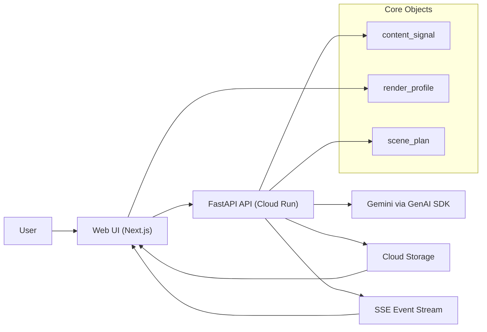
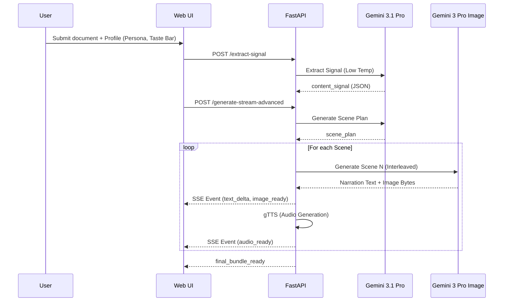

  

## Overview

  

ExplainFlow is an event-driven Creative Storyteller pipeline that transforms either a prompt or a long document into an interleaved visual explainer stream. The system is designed as an "Explainer Director," automating the transition from unstructured source material to a high-fidelity narrative asset.

  

## Core Data Objects

  

- **`content_signal`**: style-agnostic extraction (JSON) of source material containing the thesis, key claims, narrative beats, and visual candidates.

- **`render_profile`**: user-defined controls for audience persona, domain context, information density, and "Taste Bar" (quality/style constraints).

- **`scene_plan`**: style-conditioned storyboard used to drive interleaved multimodal generation.

  

**Canonical schemas:**

- `schemas/content_signal.schema.json`

- `schemas/render_profile.schema.json`

- `schemas/scene_plan.schema.json`

  

## The "Nano Banana" Orchestration Loop

  

To deliver true interleaved multimodal output without triggering browser SSE timeouts, ExplainFlow employs a specialized orchestration pattern:

  

1. **Extraction (Gemini 3.1 Pro):** Parses material into a locked `content_signal`.

2. **Planning (Gemini 3.1 Pro):** Maps the signal into a storyboard based on persona and density.

3. **Orchestrated Streaming (Gemini 3 Pro Image):** The backend loops through scenes, sending scoped prompts to `gemini-3-pro-image-preview`. This forces the model to emit narration text immediately followed by high-quality `inline_data` image bytes, ensuring a continuous real-time stream.

  

## System Components

  

- **Next.js Web App**

- **Quick Generate**: One-click prompt path.

- **Advanced Studio**: Granular profile control with high-contrast Mandelbrot/Vitruvian UI.

- **Live Timeline**: Consumes Server-Sent Events (SSE) to render text deltas, images, and audio.

- **FastAPI Backend**

- Orchestration logic, event emission, and asset persistence.

- Integration with `gTTS` for synchronized voiceover generation.

- **Gemini via Google GenAI SDK**

- `gemini-3.1-pro-preview`: Logic, extraction, and structured planning.

- `gemini-3-pro-image-preview`: Multimodal interleaved generation.

- **Google Cloud Infrastructure**

- **Cloud Run**: Fully managed hosting with 300s timeouts.

- **Cloud Storage**: Bucket-backed persistence for generated media assets.

  

## Component Diagram

  

  

## Request Flow

  

  

## API Surface

  

- `POST /extract-signal`: Input document -> Output `content_signal`.

- `POST /generate-stream-advanced`: Content Signal + Render Profile -> SSE Stream.

- `POST /regenerate-scene`: Targeted scene recompute without full rerun.

- `GET /final-bundle/{run_id}`: Transcript, scene manifest, and media links.

  

## Event Contract (SSE)

  

- `scene_queue_ready`: Initial storyboard manifest.

- `scene_start`: Start of a specific scene block (with `claim_refs`).

- `story_text_delta`: Real-time narration text streaming.

- `diagram_ready`: Inline multimodal image completion.

- `audio_ready`: Local/Cloud asset URL for `gTTS` audio.

- `scene_done`: Completion signal for a scene block.

- `final_bundle_ready`: Transition to final media review.

  

## Advanced Logic & Differentiation

  

1. **One-time Extraction**: `content_signal` is generated once, avoiding expensive logic reruns.

2. **Audience Constraints**: Support for `persona`, `must_include`, and `must_avoid` rules.

3. **Taste Bar**: Injects quality and art direction constraints directly into the model's "thinking" phase.

4. **Traceability**: Every scene carries badges proving its origin in the source document.

  

## Deployment Profile

  

- **Environment**: Cloud Run (us-central1)

- **Resources**: 2Gi RAM / 2 CPU (to handle concurrent multimodal streaming).

- **Timeout**: 300s (Critical for high-latency "Nano Banana" image generation).