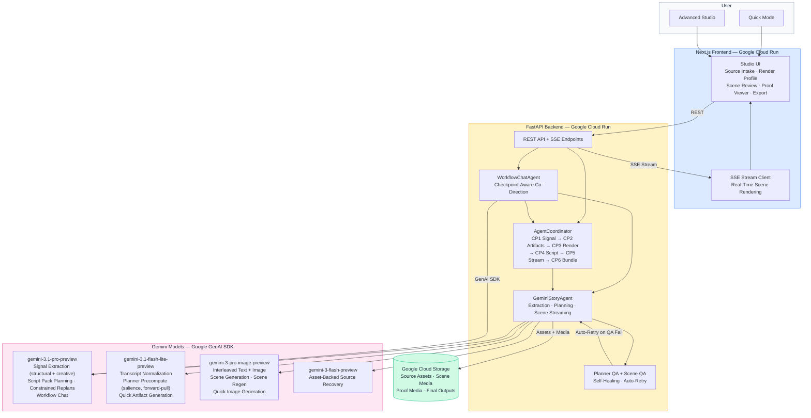
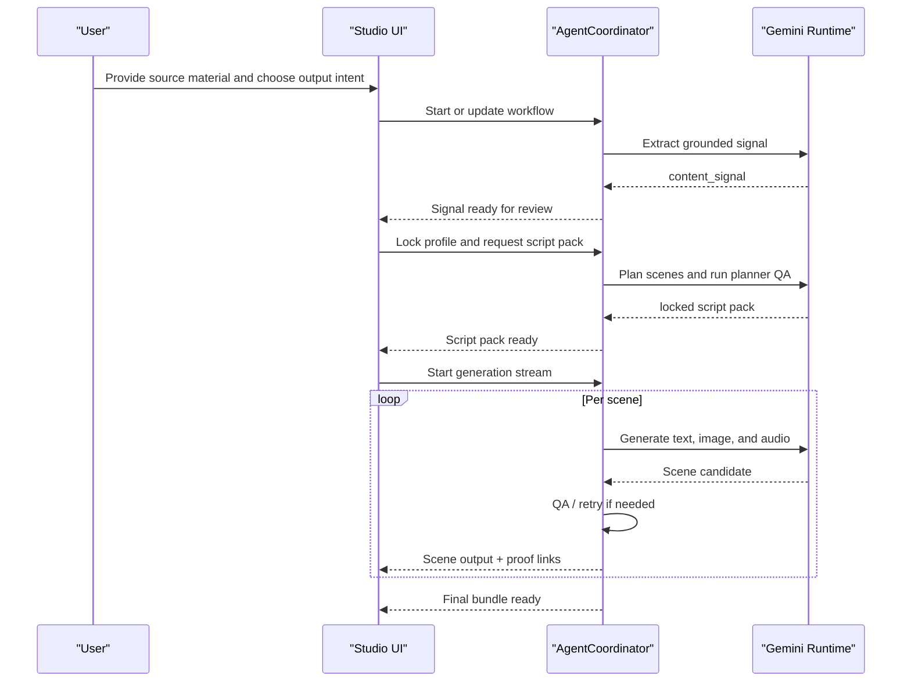
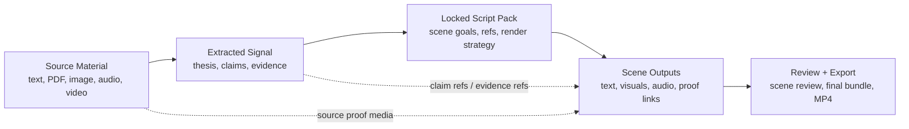

# ExplainFlow: AI Production Studio

*Built for the Gemini Live Agent Challenge.*

**ExplainFlow is an agent-coordinated AI Production Studio that transforms documents, PDFs, and media into grounded visual explainer streams where every claim links back to the original source.**

It has two modes:

- **Advanced Studio** — a staged workflow for source ingestion, signal extraction, render-profile locking, script-pack planning, live scene generation with QA retries, proof-linked review, and export
- **Quick** — a faster path that produces a grounded artifact, Proof Reel, playlist, and cinematic MP4 from the same inputs

Unlike standard AI generators, ExplainFlow uses a checkpoint-driven agentic workflow. Users can pause, review, co-direct, and verify source-proof backing for generated claims before final rendering. It is built on Gemini via the Google GenAI SDK and runs on Google Cloud Run and Cloud Storage.

## The Differentiator

Most AI generators go directly from source to final output. **ExplainFlow does not.** It exposes the lifecycle in the middle:

1. The extracted signal can be reviewed.
2. The script pack is locked before rendering.
3. The planner self-checks and repairs weak plans automatically.
4. Each scene can be reviewed, retried, or selectively regenerated without rerunning the whole workflow.
5. **Proof remains attached to the output.**

This is optimized for **controllability, recovery, and traceability**, not just blind generation speed.

## Live Demo

ExplainFlow is deployed and available for testing. No login or credentials required.

- **Studio**: https://explainflow-web-nxgdm2zy3a-uc.a.run.app
- **API**: https://explainflow-api-nxgdm2zy3a-uc.a.run.app

### Quick Mode

1. Open the Studio link above and select **Quick**.
2. Upload a video or paste source text.
3. Set the topic to: **Explain this video to non-technical students in a playful tone.**
4. Click **Generate**.
5. The artifact appears in seconds — four grounded blocks with claim refs and evidence.
6. Click **Proof Reel** to see a deterministic walkthrough of the artifact with source-backed evidence.
7. Click **Export MP4** to render a cinematic video from the artifact.

### Advanced Studio

1. Select **Advanced** from the landing page.
2. Paste the following source text:
   > Explain Mandelbrot's core idea through the coastline paradox: the closer you measure, the longer the coastline becomes.
3. Click **Extract Signal** and review the extracted signal (thesis, claims, evidence, narrative beats) in the Content Signal panel.
4. Lock the render profile with the following settings:
   - **Artifact Type**: Storyboard Grid
   - **Visual Mode**: Hybrid
   - **Audience Level**: Intermediate
   - **Audience Persona**: Curious systems thinker
   - **Taste Bar**: Highest
5. Click **Generate Script Pack** — the planner builds a scene-by-scene production manifest with QA checks.
6. Click **Start Generation** — scenes stream in real time with text, images, and audio. The Agent Session Notes panel shows checkpoint progress and QA status as they happen.
7. After generation, click any claim badge on a scene card to open the **Proof Viewer** and inspect the backing evidence.
8. Optionally regenerate any individual scene with a custom instruction.
9. Click **Export** for a ZIP bundle (script + images + audio) or **Export MP4** for a rendered video.

## Core Capabilities

- **Agentic Coordination**: A persistent `AgentCoordinator` manages production gates (Signal, Profile, Script) using a state-aware `workflow_id`.
- **Agent Harness**: A staged harness manages checkpoints, self-checks the plan before generation, validates scenes during streaming, and preserves proof-aware recovery paths.
- **Interleaved Multimodal Output**: Streams scene-by-scene text, visuals, audio, and proof-linked media instead of waiting to reveal only a final artifact.
- **Self-Healing Production**: An Auto QA Gate scores every scene. If quality or alignment fails, the director automatically triggers a retry to fix the scene in real-time.
- **Visual Chaining**: Passes visual anchor terms between scenes to prevent narrative drift.
- **Proof-Linked Generation**: Carries claim refs, evidence refs, and source-proof media from extraction through scene review and proof playback.
- **Conversational Co-Direction**: The `WorkflowChatAgent` lets users adjust styles, personas, or narrative focus through natural language at any checkpoint.
- **Cinematic MP4 Export**: Takes generated images, synthesized voiceover audio, and source proof clips, then bundles them with Ken Burns panning, crossfade transitions, and timed overlays into a single exportable video.
- **Production-Grade Export**: Package your validated explainer into a ZIP bundle containing the script, high-res images, and synchronized audio.

## System Architecture



### Director Workflow



### Data Anatomy



For the exact route-level workflow and checkpoint ownership, see [`docs/architecture.md`](./docs/architecture.md).

## Technical Core

### 1. Signal Extraction
Extracts a style-agnostic `content_signal` (Thesis, Key Claims, Narrative Beats) using `gemini-3.1-pro-preview`.

### 2. Render Profiling
A multi-stage intake process to define:
- **Audience Persona**: (e.g., Venture Capitalist, Student, Engineer)
- **Art Direction**: (Diagram, Illustration, Hybrid)
- **Constraints**: `must_include` and `must_avoid` rules for strict content alignment.

### 3. Script Pack Planning and QA
The planner compiles a production manifest before generation so every scene has:

- scene count and pacing budget
- claim coverage across the planned narrative
- acceptance checks per scene
- render strategy before expensive generation starts
- proof attachment opportunities (`claim_refs`, `evidence_refs`, `source_media`)

Before or around script-pack planning, ExplainFlow can also run:

- **Salience analysis** — identifies what is central, high-stakes, surprising, causally important, or genuinely transformative in the source
- **Forward-pull analysis** — models narrative momentum using bait, hook, threat, reward, and payload
- **Planner QA / repair** — checks the proposed plan before scene generation and either repairs it deterministically or triggers a constrained replan

### 4. Live Multimodal Streaming
The orchestration loop delivers narration text interleaved with high-fidelity visuals from `gemini-3-pro-image-preview`. During streaming, ExplainFlow generates text, image, and optional audio scene by scene, runs scene-level QA, retries weak scenes automatically, and keeps proof links attached to the output.

### 5. Quick Derived Views
Quick is intentionally layered: artifact first, Proof Reel second, MP4 third. Each layer reuses the previous one instead of re-planning from scratch. That keeps Quick latency low while preserving claim refs, evidence refs, source-proof selection, and exportability.

### 6. Workflow Agent
The workflow chat agent can explain the current stage, inspect workflow state, recommend the next safe action, trigger tool-backed actions (extraction, lock, script-pack, stream launch), and return the workflow to the right checkpoint instead of forcing a full restart.

## How to Run Locally

For the best experience, use the live hosted links above. Local setup requires only a Gemini API key — the backend falls back to local file storage automatically when Google Cloud Storage is not configured.

### Prerequisites
- Python 3.10+
- Node.js 20+ and `npm`
- A Google GenAI API Key (with access to `gemini-3.1-pro-preview` and `gemini-3-pro-image-preview`)

### 1. Set up the Backend (FastAPI)
```bash
cd api
python3 -m venv venv
source venv/bin/activate
pip install -r requirements.txt
echo "GEMINI_API_KEY=your_api_key_here" > .env
uvicorn app.main:app --reload --port 8000
```

### 2. Set up the Frontend (Next.js)
```bash
cd web
npm install
npm run dev
```
*Frontend runs at `http://localhost:3000`. Backend runs at `http://localhost:8000`.*

---

Built for the **Gemini Live Agent Challenge**.
