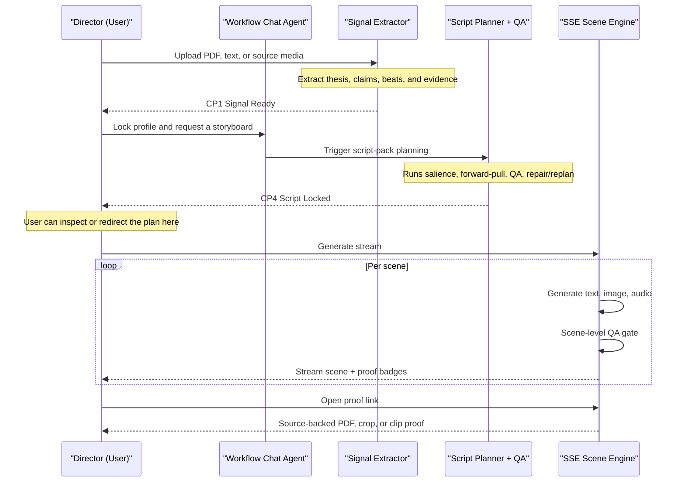
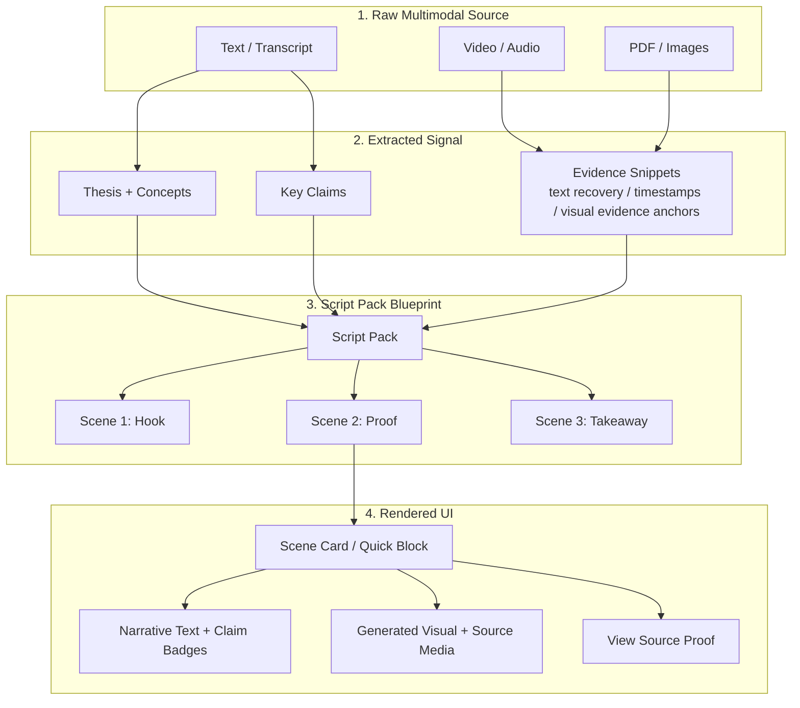

# ExplainFlow: AI Production Studio

*Built for the Gemini Live Agent Challenge.*

**ExplainFlow is an agent-coordinated AI Production Studio that transforms complex documents, PDFs, and media into high-fidelity, interactive visual explainer streams.**

Unlike standard AI generators that act as opaque black boxes, ExplainFlow uses a checkpoint-driven agentic workflow. It allows users to pause, co-direct, QA, and verify source-proof backing for generated claims before final rendering.

## Product Vision: The Explainer Director

ExplainFlow represents a pivot from simple "generation" to **"Directed Production."** The system acts as an autonomous studio where a central coordinator manages the entire lifecycle of a visual narrative—from core signal extraction to final validated asset packaging.

### Key Capabilities (Architecture v3)
- **Agentic Coordination**: A persistent `AgentCoordinator` manages production "Gates" (Signal, Profile, Script) using a state-aware `workflow_id`.
- **Agent Harness**: ExplainFlow uses a staged agent harness, not a single prompt. The harness manages checkpoints, self-checks the plan before generation, validates scenes during streaming, and preserves proof-aware recovery paths.
- **Conversational Co-Direction**: Interact with the studio via the `WorkflowChatAgent` to adjust styles, personas, or narrative focus through natural language.
- **Self-Healing Production**: An **Auto QA Gate** scores every scene. If quality or alignment fails, the director automatically triggers a **Correction Retry** to fix the scene in real-time.
- **Visual Chaining**: Advanced multimodal continuity that passes visual anchor terms between scenes to prevent narrative drift.
- **Proof-Linked Generation**: ExplainFlow carries claim refs, evidence refs, and source-proof media from extraction through scene review and proof playback.
- **Quick Derived Views**: Quick now supports the original artifact view, a deterministic Proof Reel, and a hackathon-grade MP4 export layer.
- **Production-Grade Export**: Package your validated explainer into a professional ZIP bundle containing the script, high-res images, and synchronized audio.

## Pipeline Evolution

- **Legacy (v1/v2):** Linear extraction -> planning -> interleaved generation with basic QA.
- **Current (v3):** State-aware **Agentic Studio** with conversational control, checkpoint gates, and coordinated multi-agent logic.

## Current Product Surfaces

### Advanced Studio
- checkpointed workflow from source intake to stream generation
- script-pack review before scene rendering
- scene-level regeneration, QA notes, and proof-linked evidence viewing
- uploaded source assets for PDF/image/audio/video-backed grounding

### Quick
- fast four-block artifact generation
- deterministic Proof Reel derived from those blocks
- MP4 export derived from the Proof Reel
- lighter-weight demo path that reuses the same grounding model without the full staged studio flow

## ⚖️ The Differentiator: Why Not A Black Box?

Most AI generators go directly from source to final output. **ExplainFlow does not.** It exposes the lifecycle in the middle:

1. The extracted signal can be reviewed.
2. The script pack is locked before rendering.
3. The planner self-checks and repairs weak plans automatically.
4. Each scene can be interrupted or retried during the stream.
5. **Proof remains attached to the output.**

This is optimized for **controllability, recovery, and traceability**, not just blind generation speed.

## How ExplainFlow Works

ExplainFlow is designed as a transparent production pipeline rather than a black-box generator.

At a high level:

1. ingest multimodal source material
2. extract a grounded signal
3. plan and lock a script before rendering
4. stream scenes with self-checks and retries
5. keep proof linked to the generated output

### Director Workflow



### Data Anatomy



## How to Run Locally

### Prerequisites
- Python 3.10+
- Node.js 20+ and `npm`
- A Google GenAI API Key (with access to `gemini-3.1-pro-preview` and `gemini-3-pro-image-preview`)

### 1. Set up the Backend (FastAPI)
```bash
cd api
python3 -m venv venv
source venv/bin/activate
pip install -r requirements.txt
echo "GEMINI_API_KEY=your_api_key_here" > .env
uvicorn app.main:app --reload --port 8000
```

### 2. Set up the Frontend (Next.js)
```bash
cd web
npm install
npm run dev
```
*Frontend runs at `http://localhost:3000`. Backend runs at `http://localhost:8000`.*

---

## Technical Core

### 1. Signal Extraction Layer
Extracts a style-agnostic `content_signal` (Thesis, Key Claims, Narrative Beats) using `gemini-3.1-pro-preview`.

### 2. Guided Render Profiling
A multi-stage intake process to define:
- **Audience Persona**: (e.g., Venture Capitalist, Student, Engineer)
- **Art Direction**: (Diagram, Illustration, Hybrid)
- **Constraints**: `must_include` and `must_avoid` rules for strict content alignment.

### 3. Script Pack Compilation
The planner compiles a production manifest before generation, ensuring every scene has clear goals and "Acceptance Checks."

### Why Script Pack Is A Checkpoint
ExplainFlow intentionally does **not** stream scenes immediately after signal extraction and render profiling.

Instead, it stops at a `Script Pack` checkpoint to validate:

- scene count and pacing budget
- claim coverage across the planned narrative
- acceptance checks per scene
- render strategy before expensive generation starts
- proof attachment opportunities (`claim_refs`, `evidence_refs`, `source_media`)

This improves the system in three ways:

- **Recoverability**: network failures or user interruptions can resume from a locked plan instead of repeating extraction.
- **Quality**: the planner can repair or replan before scene generation fans out into text, images, and audio.
- **Traceability**: proof metadata is attached to the planned scenes before rendering, so the UI can surface grounded source links instead of retrofitting them later.

The simpler alternative would be to stream directly from `signal + render profile`, but that makes regeneration, checkpoint recovery, and proof-aware scene review much less reliable.

### 4. Live Multimodal Streaming
The "Nano Banana" orchestration loop delivers narration text interleaved with high-fidelity visuals from `gemini-3-pro-image-preview`.

### 5. Quick Derived Layers
Quick is intentionally layered:

1. `artifact` first
2. `Proof Reel` second
3. `MP4` third

Each layer reuses the previous one instead of re-planning from scratch. That keeps Quick latency low while still preserving claim refs, evidence refs, source-proof selection, and exportability.

### 6. Why The Extra Reasoning Layers Exist
ExplainFlow does not rely on a single planner prompt alone.

Before or around script-pack planning, it can run:

- **Salience analysis**
  - identifies what is central, high-stakes, surprising, causally important, or genuinely transformative in the source
- **Forward-pull analysis**
  - models narrative momentum using bait, hook, threat, reward, and payload
- **Planner QA / repair**
  - checks the proposed plan before scene generation and either repairs it deterministically or triggers a constrained replan

These layers exist because a technically correct extraction is not automatically a compelling explainer. ExplainFlow tries to preserve both:

- factual grounding
- viewer retention and scene sequencing

### 7. Why The Workflow Uses An Agent
The workflow chat agent is not just a help bot.

It can:

- explain the current workflow stage to the user
- inspect workflow state and checkpoints
- recommend the next safe action
- trigger safe tool-backed actions such as extraction, lock, script-pack generation, or stream launch
- return the workflow to the right checkpoint instead of forcing a full restart

That design makes the studio easier to steer and recover, especially when generation takes time or a network interruption happens.

This agent sits inside a larger harness that also performs:

- planner self-checks at script-pack stage
- deterministic repair and constrained replan
- scene-level QA and retry during streaming
- proof-resolution validation before evidence is shown to the user

---

## Architecture Summary

- **Frontend**: Next.js Studio UI with `AgentActivityPanel` for 100% transparency of agent decisions.
- **Backend**: FastAPI with `AgentCoordinator` service layer and SSE streaming.
- **Orchestration**:
  - **Planner**: Gemini 3.1 Pro for extraction, planning, salience, forward-pull, and planner QA
  - **Director**: Gemini 3 Pro Image for interleaved multimodal scene generation
  - **Workflow Agent**: Gemini 3.1 Pro for checkpoint-aware co-direction, explanation, and recovery
- **Infrastructure**: Cloud Run + Cloud Storage.

For detailed sequence diagrams and workflow rationale, see:
- `/docs/architecture.md`
- `/docs/signal-extraction-research.md`

---

## TODO / Roadmap

- [x] **High-Fidelity Upscale Pass**: Final bundles can upscale the current scene images without regenerating the script.
- [x] **Multimodal Ingestion**: ExplainFlow supports multimodal PDF extraction, page-linked proof, and source-backed ingestion for the current hackathon scope.
- [ ] **Advanced Video Composition**: Go beyond the current Quick MP4 v0 into higher-fidelity composition and richer playback controls.
- [ ] **Credit Protection**: Gated access PIN for public demos.

Built for the **Gemini Live Agent Challenge**.
