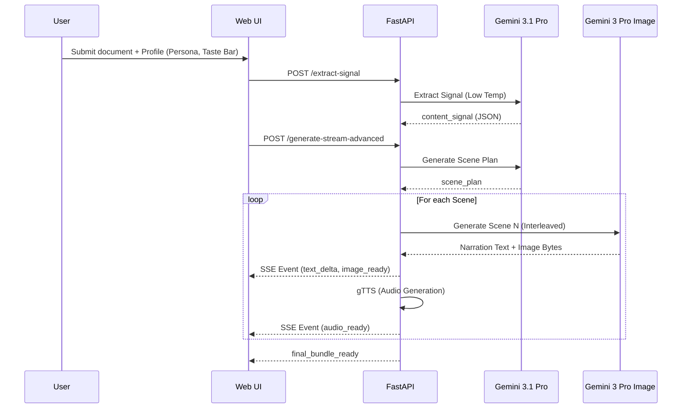

# ExplainFlow Architecture

## Overview

ExplainFlow is an agent-coordinated AI Production Studio designed to transform complex documents into high-fidelity, interleaved visual explainer streams. It represents an evolution from linear generation to a **state-aware, multi-agent orchestration model**.

This document tracks the progression from structured planning to the current agentic studio:
- **Architecture v2 (Legacy Snapshot)**: Structured planning with Script Pack compilation and per-scene self-correction.
- **Architecture v3 (Current State)**: State-aware studio managed by an `AgentCoordinator` and co-directed by a conversational `WorkflowChatAgent`.

---

## Architecture v3: The Agent-Coordinated Studio

The core shift in v3 is from a "pipeline" (where data flows one way) to a "studio" (where state is persistent and interactive).

### 1. Central Coordination (`AgentCoordinator`)
The `AgentCoordinator` is the source of truth for the system. It manages global state across concurrent sessions using a `workflow_id`.
- **Checkpoint Gates**: It enforces a strict sequence of "Production Gates":
    - **CP1 (Signal Ready)**: The document has been parsed into core claims.
    - **CP2/3 (Profile Locked)**: The audience persona and visual art direction are confirmed.
    - **CP4 (Script Locked)**: The narrative storyboard is approved for "filming."
- **Atomic State**: It prevents race conditions between the asynchronous generation loop (streaming to SSE) and the synchronous user interactions (Chat/Regeneration).

### 2. Conversational Co-Direction (`WorkflowChatAgent`)
Users interact with the studio through a conversational agent that acts as a co-director.
- **Intent-to-Action Mapping**: The agent doesn't just "talk"—it interprets user messages into system directives (`open_panel`, `extract_signal`, `generate_stream`).
- **Contextual Awareness**: It has deep access to the current `render_profile` and `content_signal`, allowing it to answer questions like "Why did you choose this persona?" or "Adjust the style to be more futuristic."

### 3. The Multimodal "Visual Chain"
To ensure **Artistic Continuity** across scenes without a massive context window, ExplainFlow uses a "Visual Chaining" technique:
- **Anchor Term Extraction**: The system extracts unique visual keywords from the *previous* scene's output.
- **Continuity Injection**: These anchor terms are injected as strict art-direction constraints into the *next* scene's multimodal prompt.
- **Result**: A consistent visual language (palette, character style, lighting) that persists through the entire story.

### 4. Self-Healing QA Gate
Every generated artifact (text, image, audio) passes through a backend **QA Gate** before reaching the user:
- **Scoring Logic**: Artifacts are scored on **Alignment** (did it follow the prompt?) and **Quality** (is it gibberish?).
- **Correction Retries**: A `FAIL` status triggers an automatic **Correction Pass**. The system generates a specific "Fix It" prompt that tells Gemini exactly what was wrong (e.g., "The image was missing the requested diagram labels") and requests a replacement.

---

## Architecture v2: Pipeline with Script Pack (Legacy Comparison)

The previous version established the foundational "Script Pack" manifest which persists in the current model as the primary execution engine.

### v2 Request Flow

---

## Technical Specifications

### API Surface (v3)
- `POST /api/workflow/start`: Initializes a new persistent production session.
- `POST /api/workflow/{id}/lock-render`: Freezes the art direction and audience persona.
- `POST /api/workflow/agent/chat`: Conversational interface for production control.
- `POST /api/final-bundle/export`: Aggregates all validated assets into a single production ZIP.

### Event-Driven Transparency (SSE)
ExplainFlow uses a rich SSE event vocabulary to ensure the user is never left in the dark:
- `script_pack_ready`: The director has finished the plan.
- `qa_status`: Live scoring results for the current scene.
- `qa_retry`: Notification that the director is "re-shooting" a scene due to quality failure.
- `claim_traceability`: Real-time logging of document grounding.

### Infrastructure Profile
- **Hosting**: Google Cloud Run (us-central1).
- **Timeout**: 300s (Critical for the "thinking" latency of `gemini-3-pro-image-preview`).
- **Memory**: 2Gi RAM / 2 CPU (To support concurrent image parsing and gTTS encoding).
