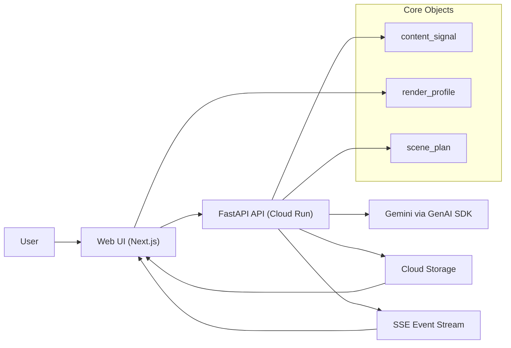
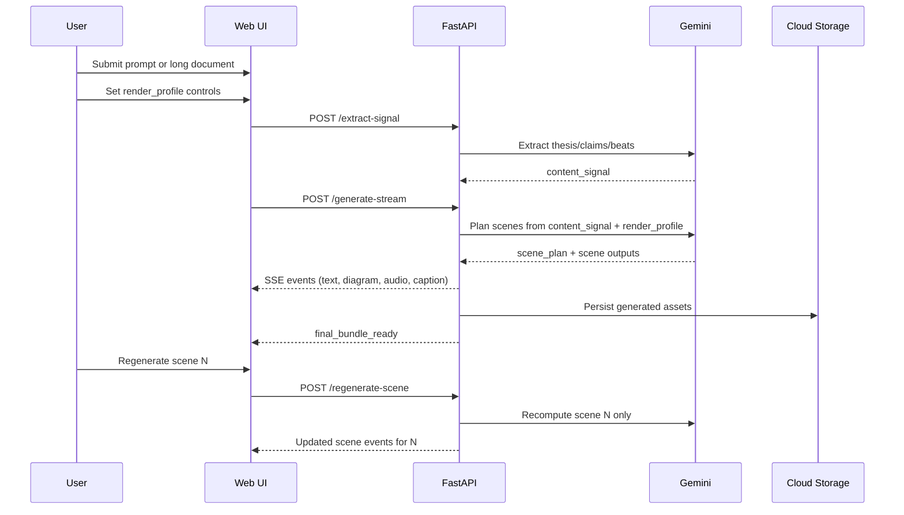

# ExplainFlow Architecture (MVP)

## Overview

ExplainFlow is an event-driven Creative Storyteller pipeline that transforms either a prompt or a long document into an interleaved explainer output. The MVP emphasizes three product behaviors:

1. Fast first-run generation from conventional prompt UX.
2. Structured control through `render_profile`.
3. Partial iteration through scene-level regeneration.

## Core Data Objects

- `content_signal`: style-agnostic extraction from source content.
- `render_profile`: user controls for visual and delivery style.
- `scene_plan`: style-conditioned plan used to drive scene generation.

Canonical schemas:
- `/Users/rk/Desktop/Gemini Live Agent Challenge/schemas/content_signal.schema.json`
- `/Users/rk/Desktop/Gemini Live Agent Challenge/schemas/render_profile.schema.json`
- `/Users/rk/Desktop/Gemini Live Agent Challenge/schemas/scene_plan.schema.json`

## System Components

- `Next.js Web App`
  - Quick Generate form
  - Advanced Studio controls
  - Live timeline UI (SSE consumer)
  - Scene trace panel and regenerate action
- `FastAPI Backend`
  - Extraction, planning, streaming, regeneration, and bundling endpoints
  - Orchestration logic and event emission
- `Gemini via Google GenAI SDK`
  - Signal extraction
  - Scene text and media prompt generation
- `Cloud Storage`
  - Generated image/audio asset storage
  - Final bundle asset references
- `Cloud Run`
  - Backend deployment target

## Component Diagram

## Request Flow

## API Surface (MVP)

- `POST /extract-signal`
  - Input: prompt/document payload
  - Output: `content_signal`
- `POST /generate-stream`
  - Input: `content_signal` reference + `render_profile`
  - Output: SSE event stream + final bundle metadata
- `POST /regenerate-scene`
  - Input: `run_id`, `scene_id`, targeted instruction
  - Output: updated events for the selected scene
- `GET /final-bundle/{run_id}`
  - Output: transcript, scene manifest, social captions

## Event Contract (SSE)

- `scene_start`
- `story_text_delta`
- `diagram_ready`
- `audio_ready`
- `caption_ready`
- `scene_done`
- `final_bundle_ready`

## Differentiation Through Architecture

1. One-time extraction:
- `content_signal` is generated once per source to avoid expensive full reruns.

2. Directed rendering:
- `render_profile` is explicit and validated, enabling consistent output control.

3. Partial regeneration:
- `scene_plan` supports scene-level recompute without invalidating the entire run.

4. Traceability:
- Scene outputs carry claim references to extracted signal elements.

## Deployment Notes

- Backend is containerized and deployed on Cloud Run.
- Generated artifacts are stored in Cloud Storage and linked in final bundle.
- The frontend can be deployed separately; MVP focus is backend proof on Google Cloud.

## Non-Goals (MVP)

- Multi-agent orchestration
- Full video compositor pipeline
- Collaborative editing/auth

These are intentionally deferred to reduce risk and maximize demo reliability.
