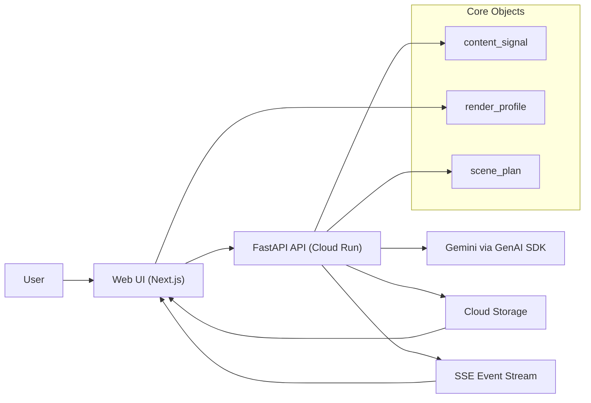
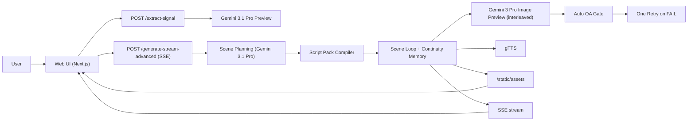
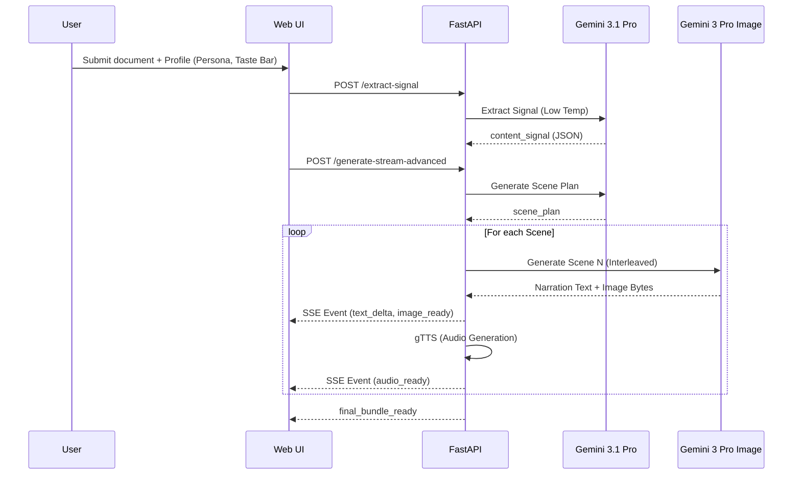
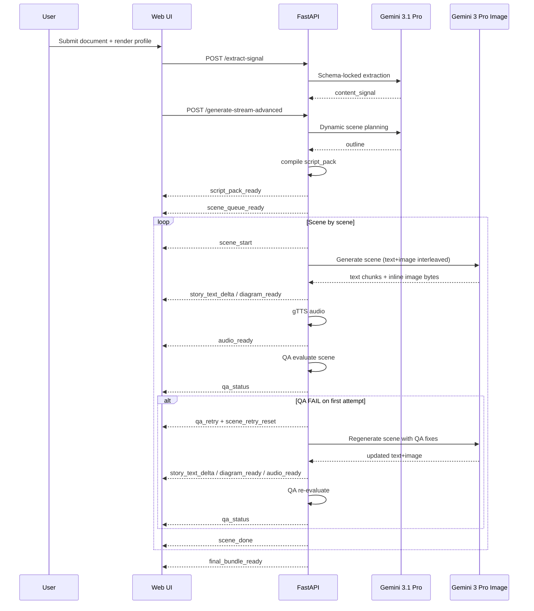

# ExplainFlow Architecture

## Overview

ExplainFlow is an event-driven Creative Storyteller pipeline that transforms either a prompt or a long document into an interleaved visual explainer stream.

This document now tracks two architecture snapshots for comparison:
- **Legacy (v1)**: extraction -> planning -> per-scene interleaved generation.
- **Current (v2)**: adds script-pack compilation, continuity memory, and auto QA with retry.

## Core Data Objects

- **`content_signal`**: style-agnostic extraction (JSON) of source material containing the thesis, key claims, narrative beats, and visual candidates.
- **`render_profile`**: user-defined controls for audience persona, domain context, information density, and "Taste Bar" (quality/style constraints).
- **`scene_plan`**: style-conditioned storyboard used to drive interleaved multimodal generation.
- **`script_pack`**: executable scene bundle produced from the plan, including `continuity_refs` and `acceptance_checks`.
- **`scene_runtime_state`**: per-scene generated outputs (`text`, `image`, `audio`) plus QA metadata (`status`, `score`, `reasons`, retry count).

**Canonical schemas:**
- `schemas/content_signal.schema.json`
- `schemas/render_profile.schema.json`
- `schemas/scene_plan.schema.json`

## Orchestration Model

To deliver true interleaved multimodal output without triggering browser SSE timeouts, ExplainFlow uses scene-scoped orchestration:

1. **Extraction (Gemini 3.1 Pro):** Parses material into a locked `content_signal`.
2. **Planning (Gemini 3.1 Pro):** Maps the signal into a storyboard based on persona and density.
3. **Script Pack Compilation (Backend):** Normalizes scene IDs, injects continuity references, and creates acceptance checks.
4. **Orchestrated Streaming (Gemini 3 Pro Image):** Backend loops through scenes and calls `gemini-3-pro-image-preview` once per scene.
5. **Auto QA Gate (Backend):** Evaluates each scene (`PASS|WARN|FAIL`) based on text/image presence, length, focus alignment, audience constraints, and continuity.
6. **Retry-on-Fail (Backend):** One automatic retry if first pass fails, with retry prompt conditioned by QA failure reasons.

## System Components

- **Next.js Web App**
  - **Quick Generate**: One-click prompt path.
  - **Advanced Studio**: Granular profile control with high-contrast Mandelbrot/Vitruvian UI.
  - **Live Timeline**: Consumes Server-Sent Events (SSE) to render text deltas, images, and audio.
  - **Script Pack Panel**: Displays planner-to-runtime bridge object for transparency.
  - **QA Overlay on Scene Cards**: Shows scene QA status, score, reasons, and retry count.
- **FastAPI Backend**
  - Orchestration logic, event emission, and asset persistence.
  - Integration with `gTTS` for synchronized voiceover generation.
- **Gemini via Google GenAI SDK**
  - `gemini-3.1-pro-preview`: Logic, extraction, and structured planning.
  - `gemini-3-pro-image-preview`: Multimodal interleaved generation.
- **Google Cloud Infrastructure**
  - **Cloud Run**: Fully managed hosting with 300s timeouts.
  - **Cloud Storage**: Bucket-backed persistence for generated media assets.

## Component Diagrams

### Legacy Diagram (v1, kept for comparison)

### Current Diagram (v2)

## Request Flows

### Legacy Flow (v1, kept for comparison)

### Current Flow (v2)

## API Surface

- `POST /extract-signal`: Input document -> Output `content_signal`.
- `GET /generate-stream`: Quick mode SSE stream.
- `POST /generate-stream-advanced`: Content Signal + Render Profile -> SSE Stream.
- `POST /regenerate-scene`: Targeted scene recompute without full rerun.
- `GET /final-bundle/{run_id}`: Transcript, scene manifest, and media links.

## SSE Event Contract

### Legacy Events (v1)

- `scene_queue_ready`: Initial storyboard manifest.
- `scene_start`: Start of a specific scene block (with `claim_refs`).
- `story_text_delta`: Real-time narration text streaming.
- `diagram_ready`: Inline multimodal image completion.
- `audio_ready`: Local/Cloud asset URL for `gTTS` audio.
- `scene_done`: Completion signal for a scene block.
- `final_bundle_ready`: Transition to final media review.

### Current Events (v2)

- `script_pack_ready`: compiled execution plan including continuity refs and acceptance checks.
- `scene_queue_ready`: initial scene queue with IDs/titles/claim refs/focus.
- `scene_start`: scene execution start.
- `story_text_delta`: narration token stream.
- `diagram_ready`: scene visual ready URL.
- `audio_ready`: scene voiceover ready URL.
- `qa_status`: QA outcome (`PASS|WARN|FAIL`) with score, reasons, word count, attempt.
- `qa_retry`: emitted when first QA fails and retry is scheduled.
- `scene_retry_reset`: client reset signal before retry stream.
- `scene_done`: scene terminal event with `qa_status` and auto-retry count.
- `final_bundle_ready`: run completed.
- `error`: fatal stream error.

## Advanced Logic and Differentiation

1. **One-time Extraction**: `content_signal` is generated once, avoiding expensive logic reruns.
2. **Audience Constraints**: Support for `persona`, `must_include`, and `must_avoid` rules.
3. **Taste Bar**: Injects quality and art direction constraints directly into the model's "thinking" phase.
4. **Script Pack Transparency**: planning assumptions are materialized and shown to the user before generation completes.
5. **Continuity Memory**: prior-scene anchors are fed into subsequent scene prompts.
6. **Pre-user QA Gate**: output quality checks happen before scene finalization.
7. **Hybrid Control Surface**: automatic retry + manual per-scene regeneration.

## Deployment Profile

- **Environment**: Cloud Run (us-central1)
- **Resources**: 2Gi RAM / 2 CPU (to handle concurrent multimodal streaming).
- **Timeout**: 300s (Critical for high-latency "Nano Banana" image generation).
