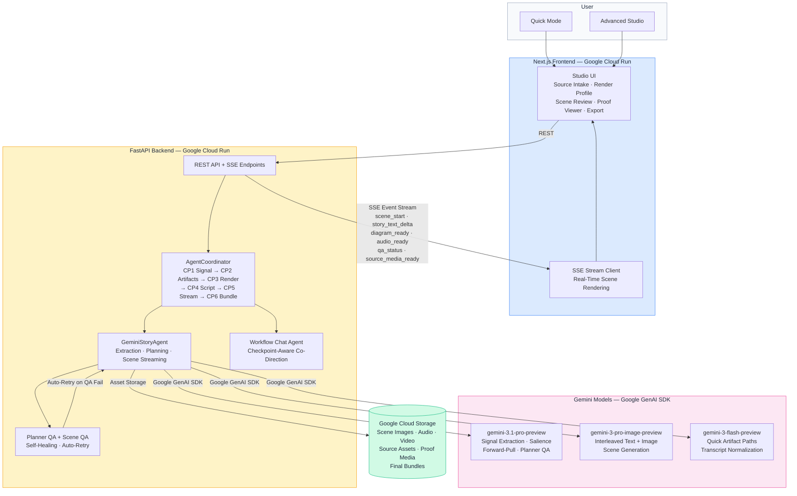
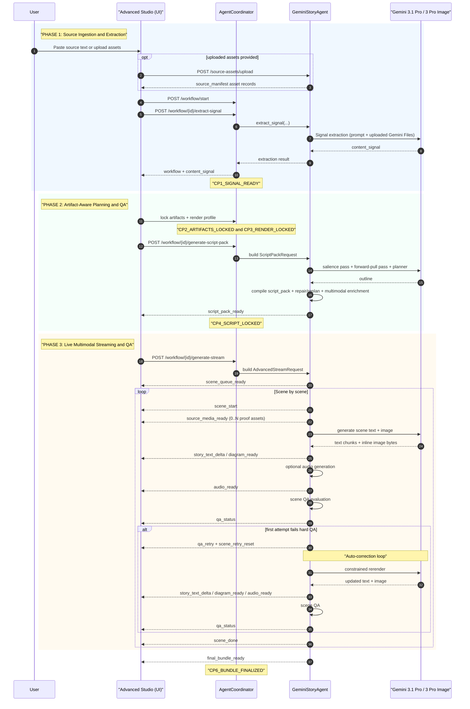
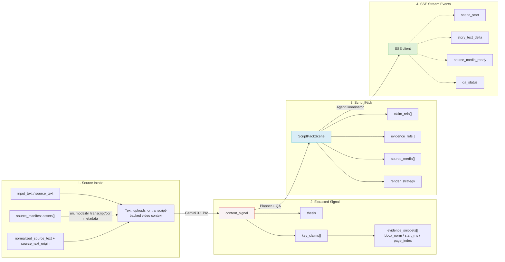

# ExplainFlow Architecture

`README.md` is the overview. This document is the detailed engineering view: the staged workflow, core contracts, reasoning layers, and runtime surfaces that make ExplainFlow work.

ExplainFlow is a workflow-driven artifact generation system. It turns a locked source signal into a script pack, streams scene generation with QA gates, and now supports a first multimodal traceability slice for audio timestamps and image/PDF proof regions.

The system is intentionally not a generic notebook. Its core differentiators are:

- checkpointed director workflow
- artifact-aware planning
- claim-grounded traceability
- scene-level repair and regeneration
- proof-linked source media in the Advanced Studio

ExplainFlow currently exposes two product surfaces:

- **Advanced Studio**
  - staged workflow, planner review, proof-linked scene generation
- **Quick**
  - lightweight artifact generation with derived Proof Reel and MP4 views

## System Architecture

## Reading Guide

If you are new to the repo, read this document in this order:

1. `System Architecture` for the high-level component map.
2. `End-to-End Flow` for the full staged lifecycle.
3. `Workflow Checkpoints`, `Planning Layers`, and `Scene Generation and QA` for the architectural choices that make the workflow inspectable and repairable.
4. `Codebase Shape` and `API Surface` last, as the implementation appendix.

## End-to-End Flow

This sequence describes the checkpointed Advanced Studio path. Quick follows a lighter derived flow (`artifact -> Proof Reel -> MP4`) and does not reuse every workflow checkpoint.

## Data Contracts

### Input

The extraction layer now supports three intake shapes:

- text-first input
  - `input_text` or `source_text`
- asset-backed input
  - `source_manifest.assets[]`
- transcript-backed source video input
  - transcript in `source_text`
  - source identity in `source_manifest.assets[]`
  - normalization and provenance in `normalized_source_text` and `source_text_origin`

Each `source_manifest.assets[]` item can carry:

- `asset_id`
- `modality`
- `uri`
- optional transcript, OCR, duration, page, and metadata fields

In practice, that means ExplainFlow can begin extraction from:

- text-only
- uploaded assets only
- text plus uploaded assets
- uploaded video plus transcript/captions
- YouTube URL plus transcript/captions in Quick, represented internally as transcript-backed video context rather than a dedicated `youtube_url` request field

### Extracted Signal

`content_signal` remains the planner backbone. Important fields:

- `thesis`
- `key_claims`
- `concepts`
- `visual_candidates`
- `narrative_beats`

For multimodal inputs, each `key_claim` can now carry structured `evidence_snippets[]`, which are normalized into evidence refs with:

- `evidence_id`
- `asset_id`
- `modality`
- `start_ms` / `end_ms`
- `page_index`
- `bbox_norm`
- `quote_text` / `transcript_text`
- `visual_context`

### Script Pack

`ScriptPack` and `ScriptPackScene` are still the shared planner contract. Important scene fields now include:

- `claim_refs`
- `evidence_refs`
- `source_media[]`
- `render_strategy`
- artifact-specific fields such as `scene_mode`, `layout_template`, `focal_subject`, `modules`, `visual_hierarchy`

ExplainFlow still uses JSON contracts throughout. Multimodal traceability is represented as structured fields, not XML tags.

## Workflow Checkpoints

The coordinator uses six named checkpoints:

- `CP1_SIGNAL_READY`
- `CP2_ARTIFACTS_LOCKED`
- `CP3_RENDER_LOCKED`
- `CP4_SCRIPT_LOCKED`
- `CP5_STREAM_COMPLETE`
- `CP6_BUNDLE_FINALIZED`

Key properties of the workflow layer:

- source changes invalidate downstream checkpoints
- artifact and render changes invalidate only the necessary later checkpoints
- fidelity-only final-bundle upgrades preserve the locked script pack
- workflow chat can answer questions without forcing checkpoint regressions

`AgentCoordinator` now also persists `source_manifest` so script-pack generation and stream generation can reconstruct the same multimodal source context later.

### Why `CP4_SCRIPT_LOCKED` Exists

The Script Pack checkpoint is the architectural hinge of ExplainFlow.

ExplainFlow could stream directly from:

- extracted signal
- locked artifact/render profile

But that would make the system faster only on the happy path. It would also make it much weaker operationally.

Before scene rendering starts, the Script Pack checkpoint gives the system one stable place to validate:

- scene count and pacing budget
- claim coverage across the full story
- per-scene acceptance checks
- artifact/layout intent
- proof affordances such as `claim_refs`, `evidence_refs`, and `source_media`
- planner QA and repair/replan decisions

That checkpoint improves the system in practice:

- **Recovery**: if the network drops or the browser refreshes, the workflow can resume from a locked plan instead of rerunning extraction.
- **Control**: the user can inspect or redirect the plan before paying for scene text, image, and audio generation.
- **Quality**: planner repair happens once at the plan level instead of trying to patch scene drift after rendering has already begun.
- **Traceability**: proof metadata can be attached to planned scenes before the stream, so evidence viewing is part of the generation flow rather than an afterthought.

So the Script Pack gate is not bureaucracy. It is the boundary that makes staged recovery, proof-aware streaming, and consistent interleaved generation feasible.

## Planning Layers

The planner resolves one artifact policy before scene budgeting and enrichment routing.

| Artifact Type | Planning Mode | Default Scene Count | Salience Pass | Forward-Pull Pass |
| --- | --- | ---: | --- | --- |
| `storyboard_grid` | `sequential` | `4` | `FULL` | `FULL` |
| `comparison_one_pager` | `static` | `1` | `FULL` | `LITE` |
| `slide_thumbnail` | `static` | `1` | `LITE` | `FULL` |
| `technical_infographic` | `static` | `1` | `FULL` | `OFF` |
| `process_diagram` | `static` | `1` | `FULL` | `OFF` |

Important semantic note:

- the legacy artifact key `comparison_one_pager` now behaves as a generic modular one-pager board, not a strict left-right comparison layout

Planner execution currently includes:

- artifact policy resolution
- scene budget derivation
- optional salience pass
- optional forward-pull pass
- outline generation
- deterministic repair
- one constrained replan if hard issues survive repair
- planner QA summary emission

### Why Salience Exists

Signal extraction is good at recovering what the source says.
Salience is there to decide what matters most for explanation.

The salience pass highlights:

- central ideas rather than side details
- stakes and consequences rather than flat facts
- surprise or contrast that deserves scene emphasis
- causal leverage: what changes the rest of the story if removed
- transformation: what moves the audience from old frame to new frame

Without that pass, the planner tends to overvalue whatever is merely explicit or repeated.
With it, ExplainFlow can budget scenes around the claims that carry the most explanatory weight.

### Why Forward-Pull Exists

Forward-pull is the retention layer.

It uses a simple narrative lens:

- **Bait**
  - what creates initial curiosity
- **Hook**
  - what makes the viewer stay for the next beat
- **Threat**
  - what raises tension, risk, or unresolved stakes
- **Reward**
  - what payoff or clarity the viewer gets for continuing
- **Payload**
  - what durable insight should land by the end

This is not meant to turn ExplainFlow into clickbait.
It exists because strong explainers are not only correct; they pull the audience forward scene by scene.

In practice, this layer helps:

- choose a stronger opener
- avoid dead middle scenes
- place proof after curiosity instead of before it
- preserve a sense of payoff across the storyboard

### Why Planner QA, Repair, And Replan Exist

The planner is allowed to be ambitious, but not sloppy.

Before scene generation begins, ExplainFlow checks the plan for:

- missing claim coverage
- weak scene progression
- bad artifact/layout fit
- missing acceptance checks
- proof or traceability gaps

If the issues are mechanical, ExplainFlow repairs them deterministically.
If hard issues survive, it triggers one constrained replan rather than wasting a full generation run on a weak plan.

This is cheaper and more reliable than trying to fix every problem later at the scene level.

## Quick: Derived Layers, Not Replanning

Quick is intentionally separate from the staged Advanced path.

Its current flow is:

1. build a four-block artifact
2. deterministically derive a Proof Reel from those blocks
3. optionally derive an MP4 from the Proof Reel

This matters because Quick is optimized for:

- lower latency
- deterministic overrides
- fast demoability
- reuse of the same proof model without a second heavy planning pass

The derived layers currently behave like this:

- **Artifact**
  - HTML-first explanation blocks with claim refs, evidence refs, and optional source media
- **Proof Reel**
  - one ordered segment per Quick block
  - chooses a cited source clip when available, otherwise the generated block image
- **MP4**
  - composes the Proof Reel into a hackathon-grade video with voiceover, Ken Burns motion, and optional local proof intercuts

Quick intentionally avoids the full checkpointed workflow unless a future product version justifies that extra complexity.

## Workflow Chat Agent: Co-Director, Not Sidebar Chat

ExplainFlow includes a workflow chat agent because the staged system is powerful but easy to misuse without state awareness.

The chat agent has two jobs:

1. explain the process
- what stage the workflow is in
- what each checkpoint means
- why the user is blocked or what is ready next

2. take safe state-aware actions
- start extraction
- confirm or lock the right stage
- generate a script pack
- launch stream generation
- recover the user to the correct checkpoint after interruption

This matters because a linear pipeline would force the user to remember hidden state.
The workflow agent makes that state legible and actionable.

Architecturally, this means the agent is not a toy conversational layer bolted on top of generation.
It is a checkpoint-aware controller with tool access, constrained actions, and workflow context.

That is also why ExplainFlow can answer questions like:

- "What is the difference between signal and script pack?"
- "What should I do next?"
- "Why do I need to confirm signal?"
- "Can I continue from here without regenerating everything?"

without collapsing the workflow back into a one-shot black box.

## Scene Generation and QA

Scene generation is still interleaved:

- narration text streams incrementally
- image output arrives via inline image bytes
- audio is generated after text when the artifact type uses voiceover

QA runs before scene finalization and scores:

- narration length by artifact/layout
- focus adherence
- `must_include`
- `must_avoid`
- continuity hints

The stream now surfaces:

- `qa_status`
- `qa_retry`
- `scene_retry_reset`
- planner QA notes at script-pack time

## Multimodal Traceability

The new multimodal layer does not replace the planner. It enriches the planned scene graph after planning and before streaming.

### Current Scope

Implemented now:

- `POST /source-assets/upload` for image, audio, and PDF assets
- Advanced Studio asset picker and manifest wiring
- Gemini Files upload during extraction for local uploaded assets
- audio proof clips via `start_ms` / `end_ms`
- image/PDF proof crops via `bbox_norm`
- source-manifest persistence through workflow state
- scene-level `evidence_refs`
- scene-level `source_media`
- clickable proof viewer in Advanced Studio
- new `source_media_ready` SSE event
- Quick Proof Reel derived from artifact blocks
- Quick MP4 export derived from Proof Reel segments

Not implemented yet:

- real video clip extraction/compositing
- automatic OCR/transcript segmentation beyond Gemini’s own file understanding
- source-media-first render strategies that skip generated visuals entirely
- proof-linked MP4 export

### Enrichment Rules

After a script pack is generated, `GeminiStoryAgent` deterministically enriches scenes:

- maps `claim_refs` to structured evidence
- adds `evidence_refs`
- adds `source_media` entries when the referenced asset exists in `source_manifest`
- upgrades `render_strategy` from `generated` to `hybrid` when proof media is attached

The first slice currently favors `hybrid` rendering:

- generated scene visuals still exist
- proof media is surfaced alongside them
- the proof viewer lets the user inspect the exact backing evidence
- extraction uploads local source assets to Gemini Files transiently, while ExplainFlow keeps its own local copy for proof playback and exports

## SSE Event Contract

### Core Stream Events

- `script_pack_ready`
  Returns the compiled script pack and optional `planner_qa_summary`.
- `scene_queue_ready`
  Returns queued scene metadata including `claim_refs`, `evidence_refs`, `render_strategy`, and `source_media_count`.
- `scene_start`
  Returns the active scene, its trace payload, `claim_refs`, `evidence_refs`, `render_strategy`, and raw `source_media` refs.
- `story_text_delta`
  Incremental narration text.
- `diagram_ready`
  Generated scene visual URL.
- `audio_ready`
  Generated voiceover URL.
- `qa_status`
  QA verdict with score, reasons, attempt, and word count.
- `qa_retry`
  Signals a retry after the first hard QA failure.
- `scene_retry_reset`
  Client reset marker before replaying a retried scene.
- `scene_done`
  Terminal per-scene event.
- `final_bundle_ready`
  Run completion with bundle URL and claim/evidence traceability.
- `error`
  Fatal stream error.

### Multimodal Proof Event

- `source_media_ready`
  Returns a resolved proof asset for the scene:
  - `asset_id`
  - `modality`
  - `usage`
  - `url`
  - `original_url`
  - `start_ms` / `end_ms`
  - `page_index`
  - `bbox_norm`
  - `claim_refs`
  - `evidence_refs`
  - `label`
  - `quote_text`
  - `visual_context`
  - `speaker`

For image/PDF proof regions, the backend can emit a cropped proof asset instead of the full original page.

## Codebase Shape

### Frontend

- `web/src/app/advanced/page.tsx`
  Advanced Studio composition root that wires the staged workflow, assistant surface, scene review, and export UI.
- `web/src/hooks/useAdvancedWorkflowActions.ts`
  Workflow mutations for extraction, profile locking, script-pack generation, and stage recovery.
- `web/src/hooks/useAdvancedGenerationStream.ts`
  Advanced SSE stream orchestration, scene updates, QA events, and final-bundle state.
- `web/src/hooks/useAdvancedWorkflowSession.ts`
  Workflow snapshot recovery, checkpoint hydration, and persisted session reload.
- `web/src/components/AdvancedSourcePanel.tsx`
  Source ingestion, uploaded-asset controls, and extraction CTA/footer layout.
- `web/src/components/AdvancedRenderProfilePanel.tsx`
  Artifact, audience, style, and constraints controls for render-profile locking.
- `web/src/components/AdvancedContentSignalPanel.tsx`
  Signal review and confirmation surface with progress summaries.
- `web/src/components/AdvancedScriptPackPanel.tsx`
  Planner QA summary, script-pack review, and script-stage progress panel.
- `web/src/components/AdvancedGenerationStreamPanel.tsx`
  Stream launch, live scene progress, and generation-stage reporting.
- `web/src/components/SceneCard.tsx`
  Per-scene card with claim badges, regeneration controls, and source-proof entry points.
- `web/src/components/FinalBundle.tsx`
  Final bundle review, Advanced MP4 export, and upscale controls.
- `web/src/app/quick/page.tsx`
  Quick workflow composition root for artifact, reel, playlist, and MP4 delivery.
- `web/src/components/QuickSourceForm.tsx`
  Quick source/topic intake, transcript expectations, and local-video warnings.
- `web/src/components/QuickReelView.tsx`
  Proof Reel review and segment playback controls.

### Backend

- `api/app/routes/generate_stream.py`
  Direct generation routes for legacy SSE, Quick artifact/reel/video flows, Quick source indexing, and non-workflow Advanced entry points.
- `api/app/routes/workflow.py`
  Checkpointed workflow orchestration routes, workflow-backed stream launch, scene regeneration, and workflow agent chat.
- `api/app/routes/assets.py`
  Source-asset upload, final-bundle export/video/download, quick-video download, and high-fidelity image upscaling endpoints.
- `api/app/routes/sessions.py`
  Final bundle retrieval by `run_id`.

### Services

- `api/app/services/gemini_story_agent.py`
  Top-level orchestration shell for extraction, planning, advanced streaming, Quick entrypoints, and regeneration paths.
- `api/app/services/agent_coordinator.py`
  Workflow state machine, checkpoint invalidation rules, and request reconstruction.
- `api/app/services/story_agent_source_media.py`
  Source-media resolution, proof-link enrichment, and scene/source evidence attachment.
- `api/app/services/story_agent_planner.py`
  Planner QA evaluation, deterministic repair, and constrained replan helpers.
- `api/app/services/story_agent_scene_generation.py`
  Scene prompt assembly, continuity hints, and proof-grounded scene-generation helpers.
- `api/app/services/story_agent_quick_workflows.py`
  Quick artifact, reel, MP4, and override orchestration.
- `api/app/services/story_agent_extraction_runtime.py`
  Extraction runtime helpers for normalized text recovery and multimodal recovery paths.
- `api/app/services/story_agent_advanced_stream.py`
  Advanced buffered scene preparation, continuity memory, and scene coordination helpers.
- `api/app/services/story_agent_advanced_qa.py`
  Advanced buffered-scene QA / retry loop.
- `api/app/services/story_agent_advanced_first_scene.py`
  Advanced first-scene live retry/QA wrapper.
- `api/app/services/interleaved_parser.py`
  Scene QA and incremental text parsing.
- `api/app/services/image_pipeline.py`
  Asset saving, thumbnail composition, proof-region cropping, and upscale helpers.
- `api/app/services/video_pipeline.py`
  Quick and Advanced MP4 composition from already generated assets.
- `api/app/services/final_bundle_export.py`
  Zip assembly for final bundle export.
- `api/app/services/source_ingest.py`
  Local source-asset ingest and manifest construction for uploaded image/audio/PDF files.
- `api/app/services/workflow_chat_agent.py`
  Checkpoint-aware chat agent for workflow explanation, safe action dispatch, and recovery guidance.

### Schemas

- `api/app/schemas/requests.py`
  Request/response models, script-pack scene schema, planner QA summary, multimodal source models.
- `api/app/schemas/events.py`
  Trace envelope, checkpoint events, scene trace updates, and SSE helpers.

## API Surface

### Direct / Legacy Generation

| Method | Route | Purpose |
| --- | --- | --- |
| `POST` | `/extract-signal` | Direct signal extraction without workflow checkpoints. |
| `GET` | `/generate-stream` | Legacy Quick SSE route kept for compatibility. |
| `POST` | `/generate-stream-advanced` | Direct Advanced stream entrypoint without workflow checkpoint state. |
| `POST` | `/generate-script-pack-advanced` | Direct Advanced script-pack generation without workflow checkpoint state. |
| `POST` | `/regenerate-scene` | Legacy standalone scene regeneration route. |

### Quick

| Method | Route | Purpose |
| --- | --- | --- |
| `POST` | `/quick-source-index/start` | Start transcript/source indexing for Quick source-backed runs. |
| `GET` | `/quick-source-index/{job_id}` | Poll Quick source-index job status. |
| `POST` | `/generate-quick-artifact` | Generate Quick artifact. |
| `POST` | `/hydrate-quick-artifact-visuals` | Fill hero and block visuals for an existing Quick artifact. |
| `POST` | `/generate-quick-reel` | Derive Proof Reel from Quick artifact blocks. |
| `POST` | `/generate-quick-video` | Render Quick MP4 from Proof Reel / artifact state. |
| `POST` | `/regenerate-quick-block` | Regenerate one Quick block in place. |
| `POST` | `/regenerate-quick-artifact` | Regenerate a wider Quick artifact slice or whole artifact. |

### Workflow

| Method | Route | Purpose |
| --- | --- | --- |
| `POST` | `/workflow/start` | Create workflow state and initial checkpoint envelope. |
| `POST` | `/workflow/{workflow_id}/extract-signal` | Run signal extraction into workflow state and mark `CP1`. |
| `GET` | `/workflow/{workflow_id}` | Retrieve workflow snapshot and checkpoint state. |
| `GET` | `/workflow/{workflow_id}/content-signal` | Retrieve the locked/extracted content signal. |
| `GET` | `/workflow/{workflow_id}/script-pack` | Retrieve the locked script pack. |
| `POST` | `/workflow/{workflow_id}/lock-artifacts` | Lock artifact scope into workflow state. |
| `POST` | `/workflow/{workflow_id}/lock-render` | Lock render profile into workflow state. |
| `POST` | `/workflow/{workflow_id}/apply-profile` | Lock artifacts and render profile together in one request. |
| `POST` | `/workflow/{workflow_id}/generate-script-pack` | Build script pack from locked workflow state and mark `CP4`. |
| `POST` | `/workflow/{workflow_id}/generate-stream` | Build Advanced stream request from locked workflow state and emit SSE events. |
| `POST` | `/workflow/{workflow_id}/regenerate-scene` | Regenerate one Advanced scene using locked workflow context. |
| `POST` | `/workflow/agent/chat` | Chat with the workflow-aware assistant agent. |

### Assets / Export

| Method | Route | Purpose |
| --- | --- | --- |
| `POST` | `/source-assets/upload` | Upload source files and build `source_manifest` asset entries. |
| `GET` | `/final-bundle/{run_id}` | Retrieve final-bundle status by run ID. |
| `POST` | `/final-bundle/export` | Export current scenes as a ZIP bundle. |
| `POST` | `/final-bundle/video` | Render Advanced MP4 from current final-bundle scenes. |
| `GET` | `/final-bundle/video/download` | Attachment-style download for rendered Advanced MP4. |
| `GET` | `/quick-video/download` | Attachment-style download for rendered Quick MP4. |
| `POST` | `/final-bundle/upscale` | Upscale existing final-bundle scene images without regeneration. |

## Frontend Rendering Model

The Advanced Studio scene card now supports:

- generated scene visuals
- generated audio
- proof-linked claim badges
- explicit `View Source Proof` action
- proof dialog for:
  - audio playback with seek fragment
  - image/PDF proof crops
  - evidence metadata display

This is the first visible multimodal UX wedge: claims can now open exact backing proof instead of behaving as passive labels.

## What This Architecture Buys You

ExplainFlow is strongest when it behaves like a director-controlled artifact engine rather than a notebook.

The architecture supports that through:

- locked signal before planning
- artifact-aware prompt routing
- deterministic planner repair
- planner QA surfaced to the user
- scene-level regeneration
- checkpoint-preserving fidelity upgrades
- multimodal proof linking without abandoning the existing JSON planner/runtime spine

## Next Technical Steps

The next incremental multimodal steps should be:

1. stronger PDF page-level evidence extraction and rasterization
2. stronger audio timestamp extraction and speaker-aware evidence refs
3. source-media-first scene rendering for selected artifacts
4. video proof clips after the evidence pipeline is stable

## Optional Documentation Polish

If there is time for final doc cleanup, the highest-value follow-ups are:

1. convert `API Surface` into a compact markdown table with route, method, and purpose
2. do one selective pass to wrap true schema keys and event names in backticks more consistently
