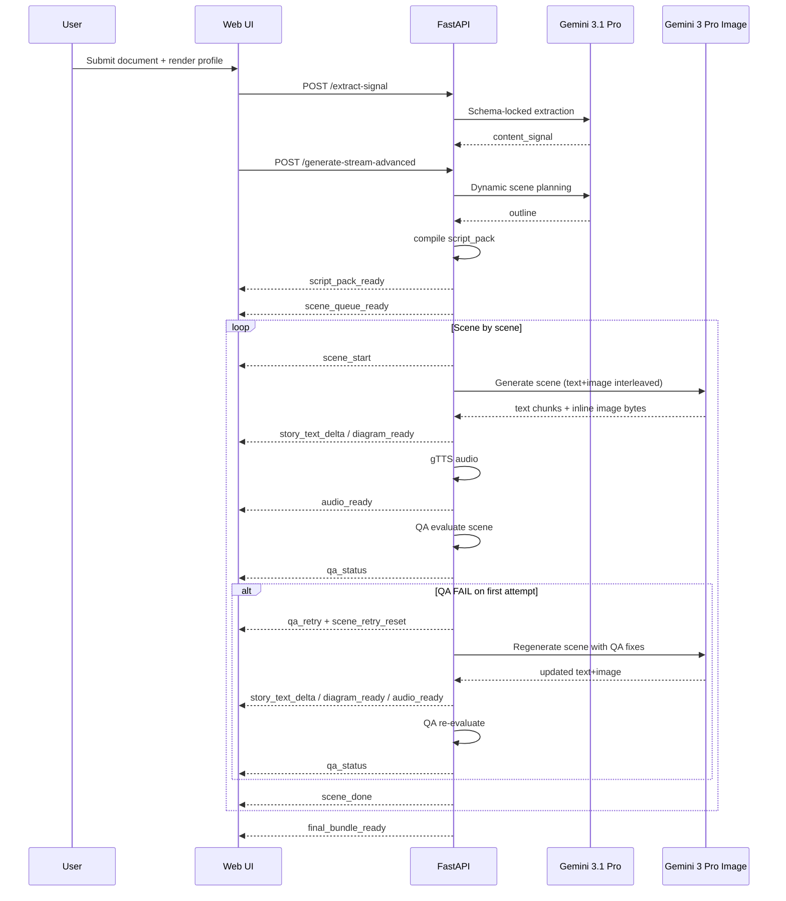

        API-->>W: SSE Event (text_delta, image_ready)
        API->>API: gTTS (Audio Generation)
        API-->>W: SSE Event (audio_ready)
    end
    API-->>W: final_bundle_ready
```

### Current Flow (v2)



## API Surface

- `POST /extract-signal`: Input document -> Output `content_signal`.
- `GET /generate-stream`: Quick mode SSE stream.
- `POST /generate-stream-advanced`: Content Signal + Render Profile -> SSE Stream.
- `POST /regenerate-scene`: Targeted scene recompute without full rerun.
- `GET /final-bundle/{run_id}`: Transcript, scene manifest, and media links.

## SSE Event Contract

### Legacy Events (v1)

- `scene_queue_ready`: Initial storyboard manifest.
- `scene_start`: Start of a specific scene block (with `claim_refs`).
- `story_text_delta`: Real-time narration text streaming.
- `diagram_ready`: Inline multimodal image completion.
- `audio_ready`: Local/Cloud asset URL for `gTTS` audio.
- `scene_done`: Completion signal for a scene block.
- `final_bundle_ready`: Transition to final media review.

### Current Events (v2)

- `script_pack_ready`: compiled execution plan including continuity refs and acceptance checks.
- `scene_queue_ready`: initial scene queue with IDs/titles/claim refs/focus.
- `scene_start`: scene execution start.
- `story_text_delta`: narration token stream.
- `diagram_ready`: scene visual ready URL.
- `audio_ready`: scene voiceover ready URL.
- `qa_status`: QA outcome (`PASS|WARN|FAIL`) with score, reasons, word count, attempt.
- `qa_retry`: emitted when first QA fails and retry is scheduled.
- `scene_retry_reset`: client reset signal before retry stream.
- `scene_done`: scene terminal event with `qa_status` and auto-retry count.
- `final_bundle_ready`: run completed.
- `error`: fatal stream error.

## Advanced Logic and Differentiation

1. **One-time Extraction**: `content_signal` is generated once, avoiding expensive logic reruns.
2. **Audience Constraints**: Support for `persona`, `must_include`, and `must_avoid` rules.
3. **Taste Bar**: Injects quality and art direction constraints directly into the model's "thinking" phase.
4. **Script Pack Transparency**: planning assumptions are materialized and shown to the user before generation completes.
5. **Continuity Memory**: prior-scene anchors are fed into subsequent scene prompts.
6. **Pre-user QA Gate**: output quality checks happen before scene finalization.
7. **Hybrid Control Surface**: automatic retry + manual per-scene regeneration.

## Deployment Profile

- **Environment**: Cloud Run (us-central1)
- **Resources**: 2Gi RAM / 2 CPU (to handle concurrent multimodal streaming).
- **Timeout**: 300s (Critical for high-latency "Nano Banana" image generation).
