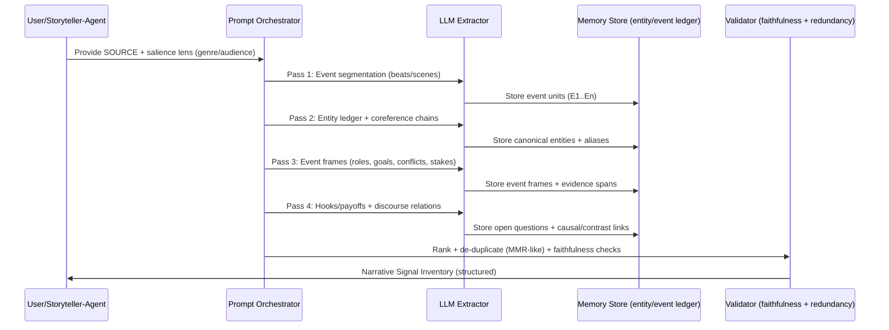
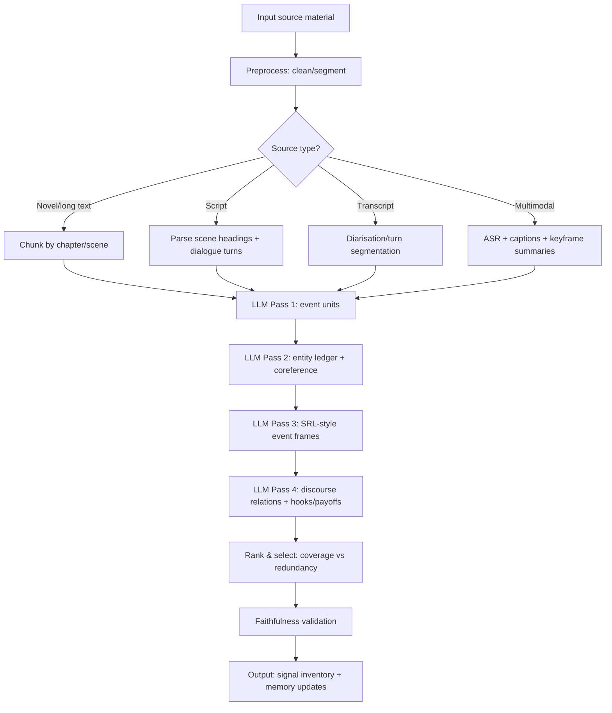

## Executive summary

Designing prompts that reliably extract *salient narrative signals* is easiest when you treat prompting as a **content-selection and structure-induction problem**, not as “asking for a summary”. This view is well-supported by research that (a) humans naturally **segment continuous experience into events** (useful “units” for story planning), (b) narrative meaning depends on **schemas/scripts** and **discourse focus** (who/what is “centre stage”), and (c) computational salience often correlates with **centrality, redundancy control, and information gain** rather than surface keywords alone.

The most robust prompt designs therefore: (1) explicitly **separate extraction from generation**, (2) force a **multi-pass pipeline** (events → entities/coreference → roles/causality → discourse relations → hooks/payoffs/themes), (3) require **evidence anchoring** (quotes/spans) to reduce hallucinated “signals”, and (4) implement **redundancy-aware ranking** (MMR-style) so the output covers diverse “story-shaping” material rather than repeating one thread.

For evaluation, you will get far more confidence if you combine **intrinsic extraction metrics** (F1 over events/roles/entities vs annotations) with **extrinsic narrative tasks** (can the downstream storyteller improve on NarrativeQA/ROCStories-style probes and human preference tests?). Use summarisation’s mature evaluation tooling—ROUGE/BERTScore, Pyramid, and factual-consistency checks (QAGS/SummaC/FactCC)—but adapt them to “signal inventories” rather than summaries.

## Problem framing and assumptions

**Goal (as interpreted):** you want *prompt methods* that elicit from an LLM (or a hybrid NLP+LLM system) a compact, structured set of “narrative-shaping” signals from source material, suitable for a downstream **creative storyteller agent** (plotting, scene generation, character arcs). This implies the extractor should prioritise *plot-relevant and story-controlling* elements (events, goals, conflicts, stakes, causal links, turning points, hooks, thematic motifs) over purely topical summarisation.

**Assumptions (stated because not fully specified):**
- The primary working modality is **text**, but some sources may be multimodal (video/images with transcripts/captions); the extractor can therefore operate on text derived from multimodal inputs (ASR, captions) and optionally incorporate vision-language signals when available.
- The system can run **multiple LLM calls** per document (iterative extraction) and maintain a lightweight memory store (entity/event ledger).
- “Salience” is **task-relative**: salient-for-storytelling differs from salient-for-news summarisation; prompt templates must therefore accept a controllable “salience lens” (genre/audience/desired arc).

**Operational definition used throughout:** *Narrative signals* are structured cues that let a storyteller reconstruct (a) **what happens** (events and event boundaries), (b) **to whom** (entities and coreference chains), (c) **why it matters** (goals, conflicts, stakes, evaluations), and (d) **how it is told** (discourse relations, viewpoint, pacing), with a final layer of **hooks/payoffs** (curiosity gaps and resolutions).

## Scientific foundations of salience and narrative signal detection

### Cognitive models that inform “what to extract”

Humans do not experience stories (or real life) as unbroken streams; they spontaneously **segment activity into events**, and those segment boundaries predict later memory and understanding. This supports prompt patterns that first ask an LLM to find **event boundaries** (scene beats/turning points), then operate over those units.

In cognitive accounts of comprehension, **schemas/scripts** (structured prior knowledge) guide what is noticed, inferred, and remembered—especially in familiar situations. For narrative extraction, this implies prompts should (a) activate relevant schemas (“heist”, “break-up”, “courtroom”, “investigation”) and (b) explicitly request script roles (agent, victim, helper, antagonist) and expected sub-events (setup → complication → result).

Curiosity and “hooks” can be grounded in the **information-gap theory**: attention spikes when a gap between what is known and what one wants to know becomes salient. This is directly actionable in prompts by requesting: *open questions introduced, withheld information, and triggers that enlarge the gap*.

Information theory provides a complementary lens: **surprisal** and related uncertainty-reduction measures formalise “unexpectedness”, which often correlates with perceived importance in both language processing and narrative experience. Prompt designs can approximate these ideas by asking for “most surprising/low-predictability” events *relative to local context* and for “state changes” (who/what becomes true that wasn’t true before).

### Linguistic and narrative theories that inform “how to structure signals”

Discourse theories model **focus and salience of entities** across utterances; centering theory explicitly treats some discourse entities as more central than others and links salience to coherence and referring expressions. For extraction, this motivates prompts that track (a) the current discourse centre, (b) centre shifts, and (c) “entity continuity” as a proxy for narrative importance.

Rhetorical and discourse parsing frameworks such as **Rhetorical Structure Theory** and the **Penn Discourse Treebank** organise text via relations (e.g., elaboration, contrast, cause). These relations are often the scaffolding of plot logic (cause → effect, concession → reversal). Signal-extraction prompts can therefore ask for a *small set of discourse relations with supporting spans*, especially causal/contrastive relations that typically drive turning points.

For narrative structure specifically, classical and structural approaches emphasise *functional parts* of stories (setup/orientation, complication, evaluation, result/resolution). In the Labov–Waletzky framework, “orientation” functions to locate person/place/time/situation, while “complication” and “evaluation” help determine what is significant and why. These categories map cleanly onto a promptable extraction schema for storyteller agents.

### Computational models that operationalise salience

Many “salience detectors” in NLP come from **extractive summarisation** and **keyword/keyphrase extraction**. Graph centrality methods (TextRank/LexRank) operationalise importance as *connectivity/centrality* among textual units; redundancy-aware selection (MMR) explicitly trades off relevance with novelty. For prompting, this supports instructions like “select top-k signals that maximise coverage and minimise redundancy” and “penalise near-duplicates”.

Topic modelling (e.g., LDA) treats documents as mixtures of latent topics; for narrative signal extraction, topic models are usually weaker than event/entity methods for plot, but valuable for **theme and motif** detection—especially in long fiction where themes recur semantically rather than lexically. Prompts can mimic this by asking for “recurring semantic clusters” and “motifs with multiple supporting instances”.

Coreference resolution and semantic role labelling provide **event semantics**: coreference links mentions to entities across a text; SRL provides predicate–argument structure (who did what to whom, when/where/how). These are the backbone of turning raw text into event graphs usable for storytelling.

Transformers introduced attention as a mechanism to prioritise parts of the input when producing outputs, but research shows attention weights are not automatically faithful explanations of “what mattered”. This matters because “attention analysis” prompts (“use attention weights to justify importance”) can be misleading; better is to ground salience in *extrinsic perturbation tests* (“if removed, what breaks?”) and evidence spans.

Finally, computational narrative work shows that modelling **event chains** around protagonists can recover story-like structure from text. This strongly supports prompt patterns that ask for “protagonist-centred event chains” and “typed relations (precondition, consequence, enablement)”.

## Research-grounded prompt patterns and templates

### Design principles that consistently improve signal extraction

**Separate “selection” from “realisation”.** Summarisation research distinguishes content selection from surface generation; prompt similarly: first extract an inventory of candidate signals, then rank and compress. This reduces the common failure mode where an LLM narrates early and loses coverage.

**Use event-first decomposition.** Because event segmentation is a natural unit of comprehension, prompts that request event boundaries and event lists before themes or style produce more stable outputs on long or dialogue-heavy inputs.

**Exploit discourse salience explicitly.** Ask for entity chains (who stays central), centre shifts (scene/plot pivots), and rhetorical relations (cause/contrast). This approximates centering and discourse parsing benefits even when you do not run a full parser.

**Force evidence anchoring.** Require each extracted signal to include a short quote or span reference. This aligns with best practices in factuality evaluation (summary must be consistent with source) and reduces “invented” motivations or off-screen events.

**Redundancy control by construction.** Add MMR-like constraints: “no two selected signals may refer to the same event unless they add new causal/goal information” and “prefer signals that increase coverage of distinct entities and plotlines”.

### The “bait–hook–…” family: identifying the original and adapting it for extraction

You recalled a “bait–hook–reward–…” approach. The closest identifiable lineage is:

- **Bait / Hook / Threat (and later Vaccime)** are discussed in memetics glossaries as components that help ideas replicate; these are commonly attributed to Douglas Hofstadter via his “Metamagical Themas” discussions of self-replicating/viral text, and later popularised/expanded in memetics commentary (including the bait–hook–threat–vaccime grouping).  
- A modern prompt-engineering adaptation called **“Bait–Hook–Reward–Payload”** appears in a blog post by Michael Taylor, explicitly described as an adaptation of Hofstadter’s bait/hook/threat model, substituting “reward” and adding “payload” as the underlying insight/content.

**How to reuse this for narrative signal extraction (not marketing copy):** treat the framework as a *retrieval lens* rather than a writing formula:
- **Bait** → the striking premise or anomaly (what breaks the default world model).  
- **Hook** → the information gap / unresolved question / looming decision.  
- **Reward** → the payoff signal (reveal, reversal, emotional release, new capability).  
- **Threat** (optional, from the older memetics framing) → explicit stakes/negative consequence if the hook is not resolved.  
- **Payload** → the durable meaning unit for the storyteller agent: theme, moral, plot engine, or character transformation.

This is not a validated psychological model of narrative excellence; it is a practical heuristic loosely aligned with established work on curiosity and attention. Treat it as a controllable “salience filter”, not as ground truth.

### Similar heuristics worth encoding as extraction lenses

Below are *promptable* heuristics that map cleanly to cognitive/narrative theory:

- **Orientation → Complication → Evaluation → Result/Resolution** (Labov–Waletzky): a high-signal decomposition for many personal narratives and scene-level plotting.  
- **Freytag-style dramatic structure** (exposition, rising action, climax, falling action, catastrophe/denouement): useful as a *macro-arc* lens for plays/screenplays and some genre fiction.  
- **Proppian functions** (structural functions in folktales): best as an optional “mythic/folkloric” lens when the source wants quest-like structure.  
- **Order / Duration / Frequency** (narratology): extraction should separate “story time” from “discourse time” (flashbacks, compression, repetition) to help a storyteller agent control pacing.  
- **Protagonist-centred event chains**: extract event sequences linked by a shared participant; strong general-purpose scaffold for long text.  
- **Information-gap hooks**: extract explicit questions, withheld causes, ambiguous identities.

### Prompt templates and patterns

The following templates are designed to be *model-agnostic* and to work with either pure LLM prompting or hybrid pipelines (LLM + NLP preprocessors). They assume an extractor role that outputs structured data.

#### Schema A: Multi-pass narrative signal inventory (recommended default)

```text
SYSTEM: You are a narrative signal extractor for a creative storyteller agent.
You must NOT write a story. You must ONLY extract signals grounded in the source.

USER: Extract a Narrative Signal Inventory from the SOURCE.
Assumptions:
- Language: English.
- Output must be faithful: if not supported by SOURCE, mark as "uncertain".
- Quote evidence: include short supporting quotes (<=12 words) for each item.

Procedure (do all steps):
1) Segment SOURCE into event units (E1..En). Use scene/beat boundaries when possible.
2) Build an Entity Ledger: canonical entities + coreference variants (aliases, pronouns).
3) For each event Ei, extract SRL-style roles:
   - agent(s), patient(s), instrument, location, time, manner
   - goals/intentions (if stated), outcomes, and state changes
4) Extract discourse relations that change interpretation (cause, contrast, concession, escalation).
5) Score salience for each event with:
   - centrality (reappears / connected to many entities),
   - stakes (threat/opportunity),
   - surprise (anomaly vs context),
   - causal leverage (enables/forces later events),
   - character transformation (belief/goal shift).
6) Select the top K signals using redundancy control:
   - no more than 1 item per “nearly identical” event,
   - ensure coverage across major entities and plotlines.

Output JSON with:
- events: [{id, boundary_rationale, summary, evidence_quotes}]
- entities: [{id, canonical_name, variants, evidence_quotes}]
- event_frames: [{event_id, roles, goal, conflict, stakes, outcome, state_change, evidence_quotes}]
- discourse_relations: [{type, from_event, to_event, explanation, evidence_quotes}]
- top_signals: [{rank, type (event/goal/conflict/hook/theme), content, why_salient, evidence_quotes}]
- open_questions: [{question, introduced_by_event, why_it_pulls_forward, evidence_quotes}]
SOURCE:
<<<PASTE SOURCE>>>
K = 12
```

Why this works: it explicitly decomposes narrative into event units (cognitive event segmentation), enforces entity tracking (coreference/discourse salience), and uses redundancy control (MMR-like).

#### Schema B: Contrastive salience (“leave-one-out” importance)

```text
SYSTEM: You are evaluating narrative salience by counterfactual deletion.

USER: For each candidate signal below, decide how much the story would change if it were removed.
Return a ranked list with brief justification grounded in SOURCE.

Rules:
- Use 3 ratings: CRITICAL / IMPORTANT / FLAVOUR.
- CRITICAL means removing it breaks causal chain, stakes, or protagonist goal.
- IMPORTANT means removing it weakens understanding, motivation, or foreshadowing.
- FLAVOUR means mostly style/world texture.

For each item provide:
- rating
- what downstream events/relations would no longer make sense
- evidence quote (<=12 words)

SOURCE:
<<<PASTE SOURCE>>>

CANDIDATE SIGNALS:
<<<PASTE EXTRACTED CANDIDATES>>>
```

This approximates perturbation-based importance (more reliable than “attention as explanation”) and forces causal reasoning.

#### Schema C: Bait–Hook–Threat–Reward–Payload lens (extraction mode)

```text
SYSTEM: You extract “forward-pull” narrative signals. Do not write prose.

USER: Using the Bait–Hook–Threat–Reward–Payload lens, extract signals from SOURCE.
Definitions:
- Bait: first anomaly/promise that grabs attention.
- Hook: the main information gap or unresolved question.
- Threat: explicit/implicit stakes if unresolved.
- Reward: payoff signals (reveal/reversal/decision/relief).
- Payload: the durable meaning/engine (theme, moral, plot engine, transformation).

Output:
- bait: {content, evidence_quote}
- hook: {question, evidence_quote}
- threat: [{stake, who_is_at_risk, evidence_quote}]
- rewards: [{payoff_signal, likely_location (event id), evidence_quote}]
- payloads: [{theme_or_engine, supporting_instances:[quotes]}]

SOURCE:
<<<PASTE SOURCE>>>
```

Lineage: Hofstadter-derived bait/hook/threat terms in memetics discussions, plus modern prompt-engineering adaptation that swaps in reward/payload.

## Evaluation metrics and experimental designs

### What to measure

A rigorous evaluation stack should test **faithfulness**, **coverage**, **usefulness-for-storytelling**, and **stability** (variance across runs/models).

**Faithfulness / grounding (must-have):**
- Use summarisation factual-consistency tooling: FactCC-style classifiers, QA-based metrics like QAGS, or NLI-style consistency checks (SummaC). Adapt by treating each extracted signal as a “claim” that must be supported by the source.

**Coverage + redundancy (content selection quality):**
- ROUGE/BERTScore can be used if you have reference “signal inventories” or reference summaries, but be cautious: lexical overlap may not reflect structural equivalence.  
- The Pyramid Method is better aligned: it weights content units by how many humans select them, capturing that there is no single perfect gold summary/inventory. You can adapt pyramids to narrative signals: “event units”, “goal units”, “stakes units”.  
- Add explicit redundancy penalties (unique entity coverage, unique event coverage); entity-centric metrics are particularly relevant for scripts/transcripts where plot is scattered across dialogue.

**Structural coherence (are the extracted signals internally consistent?):**
- Evaluate whether event chains are temporally and causally plausible and whether coreference chains are consistent (no entity splits/merges). Coreference/SRL benchmarks provide validated metrics (CoNLL-style averages for coref; argument F1 for SRL).

**Usefulness for downstream storytelling (the point of the exercise):**
- Extrinsic evaluation: feed extracted signals into a story planner/story generator and measure improvements in narrative QA, story-ending prediction, or recap generation quality (depending on target). NarrativeQA and ROCStories/Story Cloze are widely used probes for narrative understanding and causal commonsense.  
- Long-form narrative summarisation datasets (BookSum) and screenplay recap datasets (SummScreen, MovieSum) approximate the “what matters in story” judgement you ultimately want.

### Experimental designs that produce trustworthy conclusions

**Within-subject A/B testing of prompts.** Use the same document set; randomise prompt order per document; compare paired outputs to control for document difficulty. Report paired significance (e.g., bootstrap over documents) and effect sizes (especially for human preference).

**Prompt ablations (factorial design).** Treat prompt features as factors:
- event segmentation on/off  
- entity ledger on/off  
- evidence quotes on/off  
- redundancy control on/off  
- “hook lens” on/off  
This isolates which prompt constraints actually drive improvements rather than relying on intuition.

**Stability and calibration testing.**
- Run each prompt with fixed decoding (temperature ~0) and with sampling; quantify variance (Jaccard overlap of top_signals, entity list agreement).  
- Use self-consistency-style sampling *only if* you can reconcile outputs via voting/aggregation, which tends to improve reasoning stability in other domains.

**Human annotation protocols.**
- Build a lightweight annotation guide for “narrative signal units” (events, goals, stakes, hooks).  
- Measure inter-annotator reliability with Krippendorff’s alpha (handles multiple annotators, missing data).

### Datasets and benchmarks to use

Use a *portfolio* so you do not overfit to one source type.

**Narrative understanding / causal story structure**
- ROCStories / Story Cloze Test (short commonsense narratives).  
- NarrativeQA (books and movie scripts; emphasises integrative comprehension).

**Long-form narrative summarisation (novels/plays)**
- BookSum (paragraph/chapter/book summaries; long-range causal and discourse structure).

**Scripts, transcripts, dialogue-heavy sources**
- SummScreen (TV transcripts → recaps; explicitly notes scattered plot cues and proposes entity-centric evaluation).  
- MovieSum (movie screenplays → plot summaries; large and recent).  
- SAMSum (dialogue summarisation; useful for conversational transcripts).  
- AMI Meeting Corpus (multimodal meetings; useful for transcript noise/disfluency conditions).

**Classic NLP subtask benchmarks (for component validation)**
- Coreference: CoNLL-2012/OntoNotes.  
- SRL: CoNLL-2005; PropBank.  
- Discourse: PDTB 2.0/3.0; RST Discourse Treebank (if licensed).

**Multimodal narrative**
- VIST / Visual Storytelling (image sequences → stories).  
- MovieQA (movie story comprehension; text + video modalities).  
- HowTo100M (narrated video clips; useful when “source material” is instructional video with transcripts).

## Implementation notes for LLM-based storyteller agents

### Practical decoding and control settings

For extraction, you generally want **low stochasticity** so outputs are stable and comparable across prompt variants:
- Temperature ≈ 0–0.3 (or greedy decoding) for the extraction passes.
- Use sampling only in specific places: brainstorming candidate hooks/themes, then re-rank with a deterministic pass. This mirrors “generate candidates → select with constraints” patterns common in content selection.

If you do use sampling, self-consistency-style aggregation (sample multiple reasoning paths, then choose the most consistent output) can increase reliability in reasoning-heavy tasks, but it requires an explicit reconciliation step (vote/merge).

### Reasoning visibility and chain-of-thought handling

Research shows chain-of-thought prompting can enhance complex reasoning, but for production extraction systems you usually want **private reasoning with structured outputs**, not verbose rationales that (a) leak noise and (b) are hard to evaluate. A good compromise is: “think step-by-step internally; output only concise, auditable fields + evidence quotes.”

### Chunking and long-context strategy

Long fiction, scripts, and transcripts exceed typical context limits; treat extraction as a **hierarchical summarisation / aggregation** task:
1) chunk into scenes/segments,  
2) extract signals per chunk,  
3) merge into a global entity/event graph,  
4) re-rank globally for top signals.  

This is aligned with long-form narrative summarisation challenges identified in BookSum and transcript recap datasets.

### Memory and retrieval-augmented generation

A storyteller agent benefits from persistent memory of extracted signals (entity ledger, event graph, unresolved hooks). For factual domains (news, historical fiction grounded in real events), retrieval-augmented generation architectures provide a principled way to combine parametric memory with retrieved documents.

### Transformer attention analysis: useful, but use with caution

Attention mechanisms are foundational to transformers, but attention weights should not automatically be interpreted as explanations of importance. If you want introspection, prefer:
- perturbation/ablation (“remove this span; does predicted event chain break?”),
- gradient-based or attribution methods (outside the scope of prompt-only pipelines),
- or explicit discourse/event criteria.

### Mermaid workflow/timeline and extraction pipeline flowchart





## Source-type and genre adaptations with examples

### How salience differs across source types

**Novels and long fiction.** Salience is often distributed: interiority, slow-burn motivations, and recurring motifs matter as much as discrete plot events. Prioritise: (a) protagonist goal shifts, (b) irreversible state changes, (c) motif clusters, (d) timeline distortions (flashbacks). Long-form narrative datasets explicitly highlight long-range causal/temporal dependencies and rich discourse structure.

**Screenplays and scripts.** Structure is explicit (scene headings, stage directions), but plot facts are often implicit in dialogue. Use scene-boundary prompts and entity-centric tracking; recap datasets show that good content selectors are critical and that non-plot dialogue is common (comic relief, character colour).

**News articles.** Salience is constrained by journalistic conventions (who/what/when/where/why), but a storyteller agent usually wants the *narrative engine*: protagonists/antagonists (institutions), causal chain, stakes, and anomalies. Summarisation benchmarks (CNN/DailyMail, XSum) are useful for evaluation but can bias extraction toward headline-like compression rather than plot-like structure.

**Transcripts (interviews, podcasts, meetings).** Signal is noisy: disfluencies, repetitions, tangents. Focus on: stance shifts, revealed backstory, conflict points, and commitments. Dialogue summarisation datasets show that automatic metrics can be misleading relative to human judgement, reinforcing the need for human evaluation and evidence anchoring.

**Multimodal sources.** Narrative signals may be in visuals (actions, expressions, scene cuts) rather than text. Use multimodal benchmarks (visual storytelling, movie QA) to validate whether your extracted signals support genuine story understanding, not just caption-level description.

### Example prompts and expected outputs for three source types

The examples below assume you paste real source material where indicated.

#### News article source

**Prompt (news lens: causal chain + stakes + actors):**
```text
Extract story-driving signals from the NEWS SOURCE.
Prioritise: causality, stakes, actor incentives, turning points, unresolved questions.
Output: (1) 8-event chain; (2) key actors + goals; (3) central conflict; (4) 5 hooks for a thriller-style retelling.
Require evidence quotes <=12 words per item.
NEWS SOURCE:
<<<PASTE ARTICLE>>>
```

**Expected output shape (illustrative):**
- 8-event chain with explicit causal links (“A triggers B; B enables C”), plus time anchors.
- Actor table: institution/person → goal → leverage → constraints.
- Stakes: quantified when present; otherwise qualitative but source-grounded.
- Hooks: “unknown actor”, “missing motive”, “contradiction in testimony”, each tied to source spans.  
(Recommended to validate faithfulness with QA-based checks if you later generate a narrative summary.)

#### Screenplay scene

**Prompt (script lens: scene beats + subtext + reversals):**
```text
You are analysing a SCREENPLAY SCENE for story extraction.
Do NOT write dialogue. Extract:
- Scene objective for each speaking character
- Beat map (Beat 1..n): action -> reaction -> shift
- Subtext signals (what is implied but not stated), marked as "inferred" and with evidence
- One potential turning point and why it is structurally pivotal
Output JSON with evidence quotes (<=12 words).

SCENE:
<<<PASTE SCENE (with headings/dialogue/stage directions)>>>
```

**Expected output shape:**
- Character objectives (explicitly stated vs inferred).
- Beat map aligning to scene boundary cues (entrances/exits, revelations, reversals).
- A flagged turning point event (often a concession/contrast relation).

#### Interview/podcast transcript

**Prompt (transcript lens: stance shifts + personal stakes + narrative framing):**
```text
Extract narrative signals from the TRANSCRIPT.
Focus on:
- stance shifts (speaker changes their claim/emotion/goal)
- key anecdotes (events with setting, conflict, outcome)
- coreference-resolved entities (people/organisations referred to indirectly)
- open questions introduced but not answered
Return:
1) entity ledger
2) 6 most salient anecdotes (event frames)
3) 5 hooks for a character-driven narrative
Evidence quotes <=12 words.

TRANSCRIPT:
<<<PASTE TRANSCRIPT with speaker labels>>>
```

**Expected output shape:**
- Entity ledger that normalises pronouns and epithets (“my boss”, “she”) into consistent characters.
- Anecdotes as event frames (agent/patient, goal, conflict, outcome).
- Hooks anchored in information gaps and emotional shifts.

## Comparative table and prioritised sources

### Table of recommended methods

| Method / promptable approach | What it extracts best | Pros | Cons / failure modes | Complexity | Best use-cases |
|---|---|---|---|---|---|
| Event segmentation pass (beats/scenes) | Turning points, scene structure, event units | Aligns with human event perception; stabilises long-doc extraction | Boundary ambiguity; may miss slow thematic drift | Medium | Novels, scripts, transcripts |
| Entity ledger + coreference chaining | Characters/actors, continuity, relationship arcs | Reduces confusion; enables event chains | Hard in dialogue w/ many speakers; errors cascade | Medium–High | Scripts, transcripts, long fiction |
| SRL-style event frames | Who did what to whom; goals/outcomes | Produces story-plannable structures | Requires careful prompts; implicit roles may be hallucinated | Medium | Any narrative; especially action-heavy |
| Discourse relation extraction (cause/contrast) | Causality, reversals, concessions | Directly surfaces plot logic | Explicit discourse markers may be absent; implicit relations are hard | Medium–High | Mystery/thriller; argumentative nonfiction |
| Centrality ranking (TextRank/LexRank style) | Globally central sentences/phrases | Simple, strong baseline; good for topic salience | Can miss “twists” that are locally rare; graph bias | Low–Medium | News, essays; first-pass candidate mining |
| Redundancy-aware selection (MMR-like) | Diverse top-k signals | Improves coverage; reduces repetition | Needs good similarity/duplicate criteria | Medium | Any multi-thread story; long docs |
| Keyphrase/motif extraction | Themes, motifs, domain concepts | Helps style + thematic planning | Weak proxy for plot; can overfit to jargon | Low–Medium | Literary fiction; thematic retellings |
| Topic modelling lens (LDA-like) | Recurring semantic clusters | Useful for long-form theme tracking | Topics ≠ plot; can be unstable on short docs | Medium | Novels/series bibles; worldbuilding |
| Hook extraction (information-gap lens) | Open questions, withheld info | Directly supports “forward pull” planning | Can overproduce trivial questions | Low–Medium | Thriller, serial narratives, episodic arcs |
| Faithfulness validators (QAGS/SummaC/FactCC) | Hallucination detection, grounding | Critical for trustworthy extraction | May be brittle outside news; adds latency | Medium–High | Any production pipeline where errors cost time |
| RAG-supported extraction | Domain grounding + continuity across docs | Enables cross-document story worlds | Requires retrieval infrastructure and curation | High | Historical fiction, franchises, research-heavy projects |
| Attention-based “importance” heuristics | Weak signal for local focus | Easy to compute in model-internal tooling | Not reliable explanation; can mislead | Medium | Debugging only; avoid as sole salience criterion |

### Prioritised sources

Foundational sources that most directly support the report’s recommendations:

- A Mathematical Theory of Communication for information-theoretic framing of “signal” and uncertainty.  
- George Loewenstein for information-gap theory of curiosity (hook extraction).  
- William Labov and Joshua Waletzky for functional narrative parts (orientation/complication/evaluation/result).  
- Vladimir Propp for structural narrative functions (optional schema lens).  
- Gustav Freytag for dramatic arc decomposition of plays/drama.  
- Gérard Genette for discourse-time vs story-time constructs (order/duration/frequency).  
- Jerome Bruner for narrative as a mode of sense-making (broad cognitive grounding).  
- Klaus Krippendorff for reliability/annotation methodology (Krippendorff’s alpha).  
- Discourse salience and structure: centering theory and RST/PDTB corpora.  
- Practical dataset anchors for your target domain: BookSum, SummScreen, MovieSum, NarrativeQA, ROCStories.